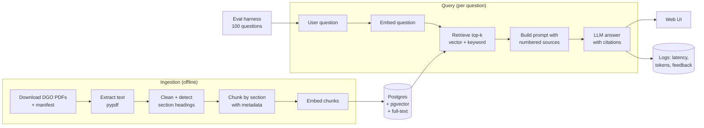

# SF Police Policy Explorer — Project Plan & Build Spec

> **Purpose of this file:** This is the complete plan for a resume project, written so that a future chat session (or any collaborator) can pick it up and continue building without re-deriving decisions. Drop it into the repo root as `PLAN.md` (and optionally copy the "Instructions for the AI assistant" section into `CLAUDE.md`).
>
> **Author:** Nav · **Plan written:** 2026-09-23 · **Status:** Not started (Week 0)

---

## 0. Instructions for the AI assistant helping with this project

Read this section first in any new chat.

- **Who Nav is:** still learning software engineering, relatively inexperienced. The goal is to *learn* and end up with a project Nav can explain line by line in an interview.
- **Teach, don't just write.** Explain concepts before code. For core logic (chunking, retrieval, prompt construction, eval scoring, the `/ask` endpoint), let Nav write the first attempt, then review it. Give hints before full solutions.
- **You may write freely:** boilerplate and config (Docker Compose, CI YAML, deploy config, `pyproject.toml`, HTML/CSS scaffolding), debugging explanations, code reviews, test ideas.
- **Nav writes:** core logic, all 100 eval questions + answers, experiment choices and interpretation, the README and write-up.
- **Keep scope tight.** Finish each phase end-to-end before adding anything. Suggest the smallest next step.
- **Respect the project rules in Section 9** (unofficial branding, no personal data, legal-info disclaimers, source terms).
- **Check where we are:** look at the checklist in Section 7 and ask Nav which boxes are done before proceeding.
- **Prices and model names change.** Recheck anything in Section 6 before recommending purchases.
- **Do not edit the local `PLAN.md` on Nav's computer without explicit permission.** Work from the project's copy of this doc and ask before writing to the local file.

---

## 1. Project summary

**What it is:** A question-answering web app that answers questions about San Francisco Police Department policy and SF police-related law. Every answer cites the exact document and section it came from (e.g., "DGO 5.01, §III.B"), and says "I don't know" when the documents don't cover the question.

**Working name:** *SF Police Policy Explorer* (unofficial, independent project — **not** affiliated with SFPD).

**Target users:** SF residents, journalists, law/policy students, police recruits studying policy, community advocates.

**Example questions it should answer:**
- "When is an SFPD officer required to activate their body-worn camera?"
- "What does SFPD policy say about vehicle pursuits?"
- "How do I file a complaint against an officer, and what happens after?"
- "What de-escalation steps does the use-of-force policy require?"
- "What does the crowd control policy say about dispersal orders?"

**Why this is a strong resume project:**
- Real, public, local data that people actually care about.
- Legal/policy documents have exact section numbers → **citation accuracy can be scored automatically**, making the eval story rigorous.
- Demonstrates full-stack AI engineering: ingestion, vector DB, retrieval, LLM integration, evals, API, deployment, CI, monitoring, real users.

**Definition of done:**
- [ ] Public live URL, answers include clickable citations + document effective dates.
- [ ] 100-question eval set with results for ≥3 experiments in a README table.
- [ ] Tests + CI (GitHub Actions) run on every push.
- [ ] README with architecture diagram, demo GIF/video, eval results, setup steps.
- [ ] ≥10 real users; at least one improvement made from their feedback.

**Timeline:** ~12 weeks at 6–8 hours/week.

---

## 2. Data sources

| Phase | Source | What it is | Size | URL |
|---|---|---|---|---|
| 1 | SFPD Department General Orders (DGOs) | SFPD's official policy rulebook | ~70+ orders across 11 categories | https://www.sanfranciscopolice.org/your-sfpd/policies/general-orders |
| 2 | SFPD Department Bulletins & Notices | Interim updates that modify policies between DGO revisions (organized by year) | Hundreds; start with last 2–3 years | https://www.sanfranciscopolice.org/your-sfpd/policies/department-bulletins-notices |
| 2 | SF Police Code | Part of SF Municipal Code most related to policing | Large; many articles | https://codelibrary.amlegal.com/codes/san_francisco/latest/sf_police/0-0-0-2 |
| Stretch | CA Penal Code / Vehicle Code (selected sections) | State law often referenced by DGOs | Pick sections only | leginfo.legislature.ca.gov |

**Example DGOs (good for first tests and eval questions):**
- DGO 5.01 — Use of Force Policy and Proper Control of a Person
- DGO 5.05 — Emergency Response and Pursuit Driving
- DGO 5.21 — Crisis Intervention Team (CIT) Response
- DGO 6.09 — Domestic Violence
- DGO 6.10 — Missing Persons
- DGO 8.03 — Crowd Control
- DGO 10.11 — Body Worn Cameras
- DGO 2.04 — Complaints Against Officers

**Data rules:**
- Before bulk-downloading, check each site's terms of use and `robots.txt`. The DGOs are on the city's own site. The municipal code is hosted by American Legal Publishing; read their terms before scraping — if bulk download isn't allowed, use a smaller set of manually saved sections.
- Download politely: add delays between requests (1–2 s), identify with a User-Agent, cache raw files locally so you never re-download unnecessarily.
- **Keep raw files in `data/raw/` and commit a manifest (`data/manifest.csv`: doc_id, title, source_url, effective_date, downloaded_at), not necessarily the files themselves.**
- **Do NOT include** DataSF incident reports or any data about individuals. This project is about rules and policies only.

---

## 3. System architecture

Two paths: **ingestion** (offline, run when documents change) and **query** (online, every question). The **eval harness** runs the query path against a fixed question set.



### Components

| Component | Responsibility | Location |
|---|---|---|
| Downloader | Fetch DGO PDFs, write manifest | `ingest/download.py` |
| Parser | PDF → clean text, detect section structure | `ingest/parse.py` |
| Chunker | Split into section-aware chunks with metadata | `ingest/chunk.py` |
| Embedder | Batch-embed chunks, write to DB | `ingest/embed.py` |
| Retriever | Vector search, keyword search, hybrid fusion | `app/retrieval.py` |
| Generator | Prompt building, LLM call, citation parsing | `app/generate.py` |
| API | FastAPI app: `/ask`, `/feedback`, `/health`, `/metrics` | `app/main.py` |
| Web UI | Search box, answer, citation cards, thumbs up/down | `web/` |
| Eval harness | Run questions, score, save results | `evals/` |
| CI | Lint, test, small eval smoke test | `.github/workflows/ci.yml` |

### Chunking strategy (important for legal/policy text)

- **Split on section structure first**, not fixed word counts. DGOs use headings like `I. PURPOSE`, `II. POLICY`, `III. DEFINITIONS`, with sub-items `A.`, `1.`, `a.`. Detect these with regex.
- If a section is longer than the max chunk size (start: ~400 words), split it further with ~50 words overlap.
- **Prepend context to each chunk** before embedding: `"DGO 10.11 Body Worn Cameras — III.B Activation: <text>"`. This greatly improves retrieval.
- Store per chunk: `doc_id`, `doc_title`, `section_path` (e.g., `III.B.2`), `effective_date`, `source_url`, `page_number`, `chunk_index`.

### Retrieval strategy (evolves over phases)

1. **v1:** vector search only, top-k = 5, cosine distance.
2. **v2 (experiment):** hybrid — vector search top 20 + Postgres full-text search top 20, merged with **Reciprocal Rank Fusion** (score = Σ 1/(60 + rank)), keep top 5. Keyword search helps with exact terms like "DGO 5.05" or "Taser".
3. **v3 (experiment):** rerank the top 20 with a reranker model or an LLM, keep top 5.

### Generation prompt (starting template — Nav should refine it)

```
You answer questions about San Francisco Police Department policy using ONLY the sources below.
Rules:
- Cite every claim with the source number in brackets, e.g. [2].
- If the sources do not answer the question, say "I couldn't find this in the policies I have." Do not guess.
- This is general information, not legal advice.

Sources:
[1] DGO 10.11 Body Worn Cameras — III.B Activation (effective 2024-xx-xx)
<chunk text>
[2] ...

Question: <user question>
```

The app maps `[n]` back to `source_url` + `section_path` to render clickable citations.

---

## 4. Tech stack

| Layer | Choice | Why | Alternative |
|---|---|---|---|
| Language | Python 3.12+ | Beginner-friendly; the main AI language | TypeScript |
| Env/packages | `uv` | Fast; one tool for venv + deps | pip + venv |
| API | FastAPI + Uvicorn | Simple, typed, auto docs at `/docs` | Flask |
| Database | Postgres 16 + pgvector | Text, metadata, vectors, full-text search in one DB | Chroma |
| DB access | psycopg 3 (raw SQL) → optionally SQLAlchemy later | Learn SQL directly first | SQLAlchemy from start |
| Local DB | Docker Compose, image `pgvector/pgvector:pg16` | One command to start | Postgres.app |
| PDF parsing | `pypdf` (fallback: `pdfplumber` for tricky layouts) | Simple | `unstructured` |
| HTML parsing | `httpx` + `beautifulsoup4` | Fetch listing pages | `requests` |
| Embeddings | **Gemini Embedding 1 or Embedding 2** (free tier: 100 RPM / 30K TPM / 1,000 RPD — either works, pick one and stick with it) | $0 on the free tier; generous daily quota easily covers embedding all ~1,000–2,000 chunks in one run if batched | OpenAI `text-embedding-3-small` (1536 dims, ~$0.02/1M tokens) — cheaper per-token if you go paid, but no free tier |
| LLM | **Gemini 3.1 Flash Lite or Gemini 3.5 Flash Lite, free tier** (`GEMINI_API_KEY`); model name in env var `LLM_MODEL` | **$0 during dev/eval**, no card required. Confirmed from account dashboard (checked 2026-09-24): 15 req/min, 250K tokens/min, **500 req/day** — enough for a full 100-question eval run in one sitting. The non-Lite "full" Flash models (3.5/3.6/3.7/3.8 Flash) are much more restricted on this account — only 5 RPM / 20 RPD — too low for eval work. | OpenAI/Anthropic paid model — no rate cap (matters once real users show up in weeks 11–12), and the paid tier doesn't use your content to improve the provider's models |
| Keyword search | Postgres full-text (`tsvector`, GIN index) | Built in | `rank_bm25` |
| Rate limiting | `slowapi` | Protect API credit on public demo | Custom middleware |
| Frontend | Plain HTML + vanilla JS (React optional later) | Focus on backend | Streamlit |
| Tests | `pytest` | Standard | — |
| Lint/format | `ruff` | One tool | black + flake8 |
| CI | GitHub Actions | Free for public repos | — |
| Hosting | Render (web service) | Deploy from GitHub | Fly.io, Railway |
| Hosted DB | Supabase Postgres (has pgvector) | Free tier | **Neon** (see note below); Render Postgres (paid) |
| Observability | Structured JSON logs + `/metrics` page; optional Langfuse | Latency, cost, errors | — |

**Note on Neon (considered 2026-09-24, keeping Supabase for now):** Neon is a strong alternative. It's plain Postgres with no SDK, which matches our raw-SQL approach. It has the same 500 MB free tier and supports pgvector. It wakes faster (~300 ms vs ~1–2 s), though it suspends after 5 min idle, where Supabase waits about a week. It also has database branching, handy for testing schema changes during experiments. The project doesn't use Supabase's extras (auth, storage, auto-generated API). Switching costs little because the schema and psycopg code stay the same; only `DATABASE_URL` changes.

**Avoid LangChain/LlamaIndex for the core pipeline.** Writing retrieval yourself (~200 lines) teaches more and is easier to explain in interviews.

**On Gemini's free tier as the LLM default:** since your generation prompt is grounded — "answer only from these sources, cite them, refuse if they don't cover it" — this is a constrained task where budget-tier models across providers tend to hold up well; the failure modes to watch (hallucinating outside the sources, wrong citation numbers) come more from prompt design and retrieval quality than raw model size. Treat this as a starting assumption to verify with your own eval numbers (see the Weeks 9–10 experiment below), not a given.

**Free-tier quotas confirmed from Nav's own AI Studio dashboard (2026-09-24), replacing earlier estimates from general web sources:**

| Model | Category | RPM | TPM | RPD |
|---|---|---|---|---|
| Gemini 3.1 Flash Lite | LLM (generation) | 15 | 250K | 500 |
| Gemini 3.5 Flash Lite | LLM (generation) | 15 | 250K | 500 |
| Gemini 3.5 / 3.6 / 3.7 / 3.8 Flash (non-Lite) | LLM (generation) | 5 | 250K | 20 |
| Gemini Embedding 1 | Embeddings | 100 | 30K | 1,000 |
| Gemini Embedding 2 | Embeddings | 100 | 30K | 1,000 |

Rate limits are per-account and can change — re-check `aistudio.google.com/rate-limit` if something that used to work starts throwing 429s.

---

## 5. Repository layout, schema, API, eval format

### Repo layout

```
sf-police-policy-explorer/
├── PLAN.md                 # this file
├── README.md
├── pyproject.toml
├── docker-compose.yml
├── .env.example            # GEMINI_API_KEY=, OPENAI_API_KEY=, DATABASE_URL=, LLM_MODEL=, EMBED_MODEL=
├── .github/workflows/ci.yml
├── data/
│   ├── manifest.csv
│   └── raw/                # downloaded PDFs (gitignored if large)
├── ingest/
│   ├── download.py
│   ├── parse.py
│   ├── chunk.py
│   └── embed.py
├── app/
│   ├── main.py             # FastAPI routes
│   ├── config.py           # env vars
│   ├── db.py
│   ├── retrieval.py
│   └── generate.py
├── web/
│   ├── index.html
│   └── app.js
├── evals/
│   ├── questions.jsonl
│   ├── run_evals.py
│   ├── judge.py
│   └── results/            # one JSON per run, timestamped
├── sql/
│   └── schema.sql
└── tests/
    ├── test_chunk.py
    ├── test_parse.py
    └── test_api.py
```

### Database schema (`sql/schema.sql`)

**The `vector(N)` dimension must match whatever embedding model actually produces the vectors** — 1536 for OpenAI `text-embedding-3-small`, 3072 for Gemini Embedding 1/2. Pick one before running ingestion; switching later means re-embedding everything and altering this column, not just changing an env var.

```sql
CREATE EXTENSION IF NOT EXISTS vector;

CREATE TABLE documents (
  id              TEXT PRIMARY KEY,          -- e.g. 'DGO-10.11'
  title           TEXT NOT NULL,
  source_type     TEXT NOT NULL,             -- 'dgo' | 'bulletin' | 'police_code'
  source_url      TEXT NOT NULL,
  effective_date  DATE,
  downloaded_at   TIMESTAMPTZ DEFAULT now()
);

CREATE TABLE chunks (
  id            BIGSERIAL PRIMARY KEY,
  document_id   TEXT REFERENCES documents(id) ON DELETE CASCADE,
  section_path  TEXT,                        -- e.g. 'III.B.2'
  section_title TEXT,
  page_number   INT,
  chunk_index   INT NOT NULL,
  content       TEXT NOT NULL,
  embedding     vector(1536),                -- 1536 for OpenAI text-embedding-3-small; use 3072 if embedding with Gemini Embedding 1/2
  tsv           tsvector GENERATED ALWAYS AS (to_tsvector('english', content)) STORED
);

CREATE INDEX chunks_embedding_idx ON chunks USING hnsw (embedding vector_cosine_ops);
CREATE INDEX chunks_tsv_idx ON chunks USING gin (tsv);

CREATE TABLE queries (
  id             BIGSERIAL PRIMARY KEY,
  question       TEXT NOT NULL,
  answer         TEXT,
  chunk_ids      BIGINT[],
  latency_ms     INT,
  input_tokens   INT,
  output_tokens  INT,
  cost_usd       NUMERIC(10,6),
  feedback       SMALLINT,                   -- 1 = thumbs up, -1 = down, NULL = none
  created_at     TIMESTAMPTZ DEFAULT now()
);
```

Do **not** store IP addresses or user identities in `queries`.

### API

| Method | Path | Body / params | Returns |
|---|---|---|---|
| POST | `/ask` | `{"question": str}` | `{"answer": str, "citations": [{"n", "document_id", "title", "section_path", "effective_date", "url"}], "query_id": int}` |
| POST | `/feedback` | `{"query_id": int, "rating": 1 or -1}` | `{"ok": true}` |
| GET | `/health` | — | `{"status": "ok"}` |
| GET | `/metrics` | — | p50/p95 latency, avg cost/query, query count, % thumbs up |

Rate limit `/ask` (start: 10 requests/minute per client). Validate question length (e.g., ≤ 500 chars).

**If running the LLM on a Gemini Flash Lite free-tier model**, `/ask`'s own rate limit should stay comfortably under Gemini's cap (15 req/min, 500 req/day) so a burst of visitors doesn't trip 429s from Gemini itself — handle that error with a friendly "busy, try again" response rather than a raw failure.

### Eval question format (`evals/questions.jsonl`, one JSON per line)

```json
{"id": "q001", "question": "When must officers activate body-worn cameras?", "type": "lookup", "expected_answer": "Short reference answer written by Nav.", "expected_sources": ["DGO-10.11"], "expected_sections": ["III.B"]}
{"id": "q087", "question": "What is SFPD's policy on drone deliveries of pizza?", "type": "unanswerable", "expected_answer": null, "expected_sources": [], "expected_sections": []}
```

**Question mix (100 total):** ~60 `lookup` (one document), ~25 `multi` (needs 2+ documents/sections), ~15 `unanswerable`.

---

## 6. Costs (checked 2026-09-23, rate limits re-checked 2026-09-24 — recheck before buying)

**Expected total:** ~$0–5 for the whole 12 weeks if using Gemini's free tier for the LLM (embeddings are still pennies); ~$5–15 if using a paid LLM throughout; ~$15–20/month if paying for an always-on demo.

| Item | Free option | Paid option | Notes |
|---|---|---|---|
| Embeddings | **Gemini Embedding 1/2 free tier: $0, 100 RPM / 30K TPM / 1,000 RPD** | $0.02 / 1M tokens (OpenAI text-embedding-3-small) | All DGOs ≈ well under 1M tokens either way → pennies if paid, free on Gemini's free tier. |
| LLM | **Gemini 3.1/3.5 Flash Lite free tier: $0, no card, 15 req/min / 500 req/day / 250K tokens/min** | Cheapest current OpenAI/Anthropic model ≈ $0.05 in / $0.25 out per 1M tokens | Free tier trade-off: Google may use free-tier content to improve their products (the paid tier does not). Fine here since content is public policy text and user questions, not personal data — worth a line in the README. Stick to the **Lite** models — the full Flash models are capped at only 20 req/day on this account, too low for eval runs. |
| API credit | — | $5–10 one-time prepay (if not using the Gemini free tier) | **Set a hard monthly spending limit** regardless of provider |
| App hosting | Render free: sleeps after 15 min idle, ~1 min wake-up | Render $7/month always-on | Free is fine until sharing with users |
| Database | Supabase free: 500 MB, pauses after 1 week inactivity | Supabase Pro $25/mo, or Render Postgres from $6/mo | Avoid Render free Postgres — expires after 30 days |
| Domain | `*.onrender.com` subdomain | ~$10–15/year | Optional |
| GitHub, Actions, Docker, VS Code | Free | — | — |

Tip: a weekly scheduled GitHub Action that hits `/health` keeps the free Supabase DB from pausing.

Sources: Nav's own Gemini API rate-limit dashboard (aistudio.google.com/rate-limit, checked 2026-09-24), Gemini API pricing (ai.google.dev/gemini-api/docs/pricing), OpenAI embedding pricing (developers.openai.com/api/docs/models/text-embedding-3-small), OpenAI pricing (developers.openai.com/api/docs/pricing), Render pricing (render.com/pricing), Render free tier (render.com/docs/free), Supabase pricing (supabase.com/pricing).

---

## 7. Step-by-step build guide (checklist)

Each phase ends with something that works. Commit after every step. Mark boxes as you go so a future chat knows where you are.

### Week 0 — Setup
- [ ] Create accounts: GitHub, **Gemini API key (aistudio.google.com — free tier, no card)**, optionally OpenAI or Anthropic API with a spending limit, Render, Supabase.
- [ ] Install on MacBook: Homebrew, Python 3.12+, `uv`, Git (+ SSH key on GitHub), Docker Desktop, VS Code (Python + Ruff extensions).
- [ ] Create public GitHub repo `sf-police-policy-explorer`; add this file as `PLAN.md`, a stub `README.md`, `.gitignore`, `.env.example`.
- [ ] `uv init`, add deps: `fastapi uvicorn psycopg[binary] pgvector httpx beautifulsoup4 pypdf google-genai openai python-dotenv slowapi pytest ruff`.
- [ ] `docker-compose.yml` with `pgvector/pgvector:pg16`; run `docker compose up -d`; apply `sql/schema.sql`.
- [ ] Set `LLM_MODEL` to a **Flash Lite** model (Gemini 3.1 Flash Lite or 3.5 Flash Lite) and `EMBED_MODEL` to Gemini Embedding 1 or 2 — see Section 4 for the confirmed rate limits.
- [ ] **Done when:** you can connect to the local DB and see empty `documents` and `chunks` tables.
- Skills refresh if needed: Python basics, Git (commit/branch/PR), terminal, HTTP/JSON, basic SQL (SQLBolt).

### Weeks 1–2 — Ingestion
- [ ] `download.py`: scrape the General Orders page for PDF links; download **10 DGOs first**; write `manifest.csv` (id, title, url, effective date if shown).
- [ ] `parse.py`: extract text per page with pypdf; strip headers/footers/page numbers; normalize whitespace.
- [ ] Inspect output by eye for 3 documents. Fix cleaning issues.
- [ ] `chunk.py`: detect section headings with regex; build section-aware chunks with metadata and context prefix.
- [ ] Tests: `test_chunk.py` (splits on headings, respects max size, overlap correct, metadata present).
- [ ] Insert `documents` and `chunks` rows (no embeddings yet).
- [ ] Expand to all ~70 DGOs once 10 work.
- [ ] **Done when:** `SELECT document_id, section_path, left(content, 80) FROM chunks LIMIT 20;` shows clean, sensible chunks.

### Weeks 3–4 — Basic RAG (command line)
- [ ] `embed.py`: batch-embed chunks (e.g., 100 per API call), store vectors; skip already-embedded chunks. With Gemini Embedding's 1,000 RPD, batching keeps this well within one day even for all ~1,000–2,000 chunks.
- [ ] `retrieval.py`: embed question → `ORDER BY embedding <=> query_vec LIMIT 5`.
- [ ] `generate.py`: build prompt from Section 3 template, call LLM, return answer + citation list.
- [ ] `ask.py` CLI: prints retrieved chunks (with section paths) **and** the answer.
- [ ] Handle "nothing relevant" → answer says it couldn't find it.
- [ ] Try the 5 example questions from Section 1 and note failures.
- [ ] **Done when:** `uv run python ask.py "When must officers turn on body cameras?"` returns a cited answer.

### Weeks 5–6 — Evals v1 (most important phase)
- [ ] Read the DGOs and **write 50 questions** in `questions.jsonl` (mix per Section 5). Nav writes these personally.
- [ ] `run_evals.py`: run all questions, record retrieved doc IDs/sections, answer, latency, tokens. A 50–100 question run fits comfortably in the Flash Lite models' 500 req/day free-tier cap.
- [ ] Score automatically: retrieval hit rate @5 (any expected source in top 5), section hit rate, refusal accuracy on `unanswerable`.
- [ ] `judge.py`: LLM-as-judge compares answer vs `expected_answer` → correct / partially / incorrect; also checks citations support claims.
- [ ] Manually check 20 judge verdicts; note agreement rate (e.g., "judge agreed with me 18/20").
- [ ] Save each run to `evals/results/<timestamp>_<config>.json`; print a summary table.
- [ ] **Done when:** one command produces a baseline score table. Record it in README.

### Weeks 7–8 — API, UI, tests, CI, deploy
- [ ] FastAPI `/ask`, `/feedback`, `/health`, `/metrics` per Section 5; log every query to `queries`.
- [ ] Rate limit with slowapi; validate input length; friendly error messages (including a graceful message if the LLM provider itself rate-limits you).
- [ ] `web/index.html` + `app.js`: question box, answer, citation cards (title, section, effective date, link), thumbs up/down, visible disclaimer.
- [ ] Tests: `test_api.py` with FastAPI TestClient (mock the LLM call).
- [ ] CI: ruff + pytest on every push; optional 5-question eval smoke test using a repo secret.
- [ ] Supabase: enable `vector` extension, apply schema, run ingestion against it.
- [ ] Render: deploy from GitHub; set env vars (never commit secrets).
- [ ] **Done when:** public URL works and CI badge is green.

### Weeks 9–10 — Experiments
- [ ] Grow eval set to 100 questions.
- [ ] Run experiments, **changing one variable at a time**, re-running evals each time:
  1. Chunk size: 200 vs 400 vs 800 words.
  2. Top-k: 3 vs 5 vs 10.
  3. Context prefix on chunks: with vs without.
  4. Hybrid search (vector + full-text, RRF) vs vector only.
  5. Reranking top 20 → 5.
  6. Small vs larger LLM (accuracy vs cost) — e.g. Gemini Flash Lite vs a non-Lite Flash model (note: the non-Lite models' 20 req/day cap means this comparison may need to run over a couple of days, or with a paid key).
  7. **LLM provider: Gemini free tier vs a paid OpenAI/Anthropic model** — compare accuracy, cost, latency, and how each behaves when you deliberately exceed its rate limit (does `/ask` degrade gracefully?).
- [ ] Phase 2 data (optional here or stretch): add Department Bulletins and/or SF Police Code sections; measure whether accuracy drops with more sources.
- [ ] Track cost/question and p50/p95 latency for each config.
- [ ] **Done when:** README has a results table with ≥3 experiments, including what you kept and why.

### Weeks 11–12 — Real users and polish
- [ ] Share with ≥10 people (classmates, a civic-tech group like Code for America brigades / SF civic tech meetups, journalism or law students).
- [ ] Review `queries` table + thumbs-down answers; find the most common failure; fix it; re-run evals to confirm.
- [ ] Add a few real user questions (anonymized) to the eval set.
- [ ] If still on Gemini's free tier, watch for 429s during any traffic spike (e.g., after sharing the link widely) — 500 requests/day on Flash Lite is generous for casual sharing but could be hit if the link goes semi-viral. This is the main practical risk of staying on the free tier for the public demo.
- [ ] Write final README (Section 8 checklist). Record a 60-second demo video/GIF.
- [ ] **Done when:** real usage data + one feedback-driven fix are documented.

---

## 8. Resume-boosting steps

### README must include
- [ ] One-line pitch + live link + "unofficial, not legal advice" note.
- [ ] 60-second demo GIF or video.
- [ ] Architecture diagram (Section 3).
- [ ] Eval results table (baseline → best config, with cost + latency).
- [ ] "Key decisions and tradeoffs" (e.g., why Postgres over a vector DB, why section-aware chunking, why Gemini's free tier for the LLM and what that trades off).
- [ ] "What I learned / what I'd do next."
- [ ] Setup instructions that work on a fresh machine.
- [ ] CI badge.

### Resume bullets (fill in real numbers)
- Built **SF Police Policy Explorer**, a retrieval-augmented Q&A system over 70+ SFPD General Orders using Python, FastAPI, and Postgres/pgvector; deployed with CI/CD via GitHub Actions.
- Designed a 100-question evaluation suite; improved answer accuracy from **[X]%** to **[Y]%** and citation accuracy to **[Z]%** through section-aware chunking and hybrid (vector + full-text) search.
- Cut cost to **$[C]/query** and p95 latency to **[T]s**; served **[U]** users and shipped fixes driven by feedback analytics.

### Extra visibility moves
- [ ] Pin the repo on GitHub; clean commit history with meaningful messages.
- [ ] Write a short blog post / LinkedIn post: "What I learned building RAG over police policy" with the eval table.
- [ ] Open issues/PRs on your own repo to show a real workflow (branch → PR → CI → merge).
- [ ] Present it at a civic-tech meetup or class; mention it in the resume "Projects" section at the top if light on experience.

### Interview prep — be ready to answer
1. Walk through what happens from question to answer.
2. Why section-aware chunking? What broke with fixed-size chunks?
3. Why Postgres + pgvector instead of a dedicated vector DB?
4. How did you build the eval set, and how do you know the LLM judge is trustworthy?
5. Which experiment helped most? Which didn't, and why did you drop it?
6. How do you prevent hallucinated legal claims? What happens with unanswerable questions?
7. How would this scale to all SF codes / 1M documents / 1,000 concurrent users?
8. How do you handle policy updates and outdated versions?
9. Why a free-tier LLM provider, and what would you change moving to production?
10. Hardest bug and how you found it.

---

## 9. Project rules (ethics, safety, legal)

- **Unofficial branding.** No SFPD logo, badge, or name as the product name. Footer on every page: *"Independent project. Not affiliated with the San Francisco Police Department. General information, not legal advice. Always check the linked official source."*
- **Policy documents only.** No incident data, arrest records, or information about individuals.
- **Show effective dates** on every citation; flag when a bulletin may have modified a DGO.
- **Refuse rather than guess.** Unanswerable questions should get a clear "couldn't find this" response. Weight refusal accuracy heavily in evals.
- **Respect source terms.** Check terms/robots before scraping; rate-limit downloads; link back to official sources.
- **Privacy.** Don't log IPs or identities; tell users questions are logged anonymously to improve the tool.
- **LLM provider data use.** If running on a free-tier API (e.g., Gemini), note in the README that the provider may use query content to improve their products — different from a paid tier's terms. Acceptable here since the content sent is public policy text and user questions, not personal data; revisit if that ever changes.
- **Cost safety.** Hard spending limit on any paid API account; rate-limit the public endpoint; handle provider rate-limit errors (429s) gracefully rather than surfacing raw failures.

---

## 10. Risks and fallbacks

| Risk | Fallback |
|---|---|
| Stuck for days on setup/deploy | Timebox 2 sessions, then ask the AI assistant with the exact error |
| PDFs parse badly (tables, columns) | Try `pdfplumber`; hand-fix the worst few; note it in README |
| Section heading regex misses formats | Log unmatched docs; fall back to fixed-size chunks for those |
| Municipal code terms forbid scraping | Stay with DGOs + bulletins; manually save a few Police Code sections |
| API bill surprises | Hard limit; use small model for most eval runs; Gemini free tier avoids this entirely for the LLM |
| Gemini free tier rate limits hit in production | Fall back to a paid model, or queue/backoff requests; this is why the experiment in Weeks 9–10 measures both |
| Accidentally using a non-Lite Flash model | Only 20 req/day free — eval runs will fail fast with 429s; switch `LLM_MODEL` back to a Flash Lite variant |
| Motivation dips | Each phase is a shippable checkpoint; post weekly progress |
| Answers look good but are wrong | Trust eval numbers, not demos |

## 11. Stretch goals (after week 12)

- Cache repeated questions (Redis) and measure latency drop.
- Background job queue for automatic re-ingestion when DGOs are updated (scheduled check of the General Orders page).
- "What changed?" feature comparing old vs new versions of a DGO.
- Streaming answers.
- Add selected CA Penal/Vehicle Code sections referenced by DGOs; cross-link citations.
- Admin dashboard for feedback, costs, and top questions.
