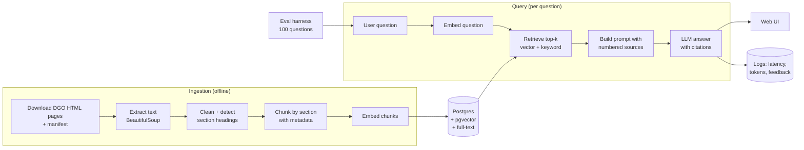

# SF Police Policy Explorer — Project Plan

> **Purpose of this file:** the forward-looking plan for this resume project, written so a future chat session (or any collaborator) can pick it up and keep building. **History, measurements, as-built details and findings live in `NOTES.md`** — read the relevant part of it before changing a component.
>
> **Author:** Nav · **Plan written:** 2026-09-23 · **Split into PLAN.md + NOTES.md:** 2026-10-03

## Current state (2026-10-06)

- **Live:** https://sf-police-policy-explorer.onrender.com — Render free web service (from `render.yaml`) + Supabase free Postgres (session pooler). Tested from laptop and phone on mobile data. Order changed on 2026-10-06: Nav chose to launch the website before evals.
- **Done:** Weeks 0–4, plus most of Weeks 7–8: `app/main.py` (`/ask`, `/feedback`, `/health`, query logging, rate limits), `web/` page, `tests/test_api.py`, Supabase + Render deploy. `uv run pytest` → 63 passed.
- **Also done (2026-10-06):** `--no-access-log` on the Render start command (uvicorn's access log printed visitor IPs — Section 9); CI in `.github/workflows/ci.yml` (ruff + format check + pytest on every push/PR).
- **Still open from Weeks 7–8:** `/metrics`; CI badge in README.
- **Then:** Weeks 5–6 evals — Nav writes the eval questions in `evals/questions.jsonl` (format and mix in Section 5), then `run_evals.py`.
- **Known limitation (fix deferred):** `chunk.py` item paths are unreliable in 7 sections — see NOTES.md §9 (proposed fix recorded there; Nav OK'd re-embedding if it's done).
- **To resume:** open Docker Desktop → `docker compose up -d` → `SELECT count(*), count(embedding) FROM chunks;` should give 857 / 857. Local site: `uv run uvicorn app.main:app --reload` → http://127.0.0.1:8000. Production deploys automatically on every push to `main`.

---

## 0. Instructions for the AI assistant helping with this project

Read this section first in any new chat.

- **Who Nav is:** still learning software engineering, relatively inexperienced. The goal is to *learn* and end up with a project Nav can explain line by line in an interview.
- **You write the code, and teach while doing it** (changed 2026-09-27 at Nav's request). Write all the code, including core logic, as well as boilerplate and config. Nav learns by reading every piece until he understands it and asking questions. So:
  - Explain the concept and the approach *before* showing the code or running commands.
  - Deliver code in small, runnable pieces (one function or file at a time), not a whole phase at once.
  - Comment the non-obvious lines; skip comments that just restate the code.
  - After each piece, call out the key decisions, the tradeoffs, and anything likely to come up in an interview.
  - Answer follow-up questions fully and patiently. Don't move on until Nav has run the piece and is happy he understands it.
- **Nav still owns the non-code decisions:** the 100 eval questions + reference answers, experiment choices and interpretation, the README and write-up. You can help edit these, but they should be his.
- **Keep scope tight.** Finish each phase end-to-end before adding anything. Suggest the smallest next step.
- **Respect the project rules in Section 9.**
- **Check where we are:** read "Current state" above and the checklist in Section 7, and ask Nav which boxes are done before proceeding.
- **Prices and model names change.** Recheck anything in Sections 4 and 6 before recommending purchases.
- **Do not edit the local `PLAN.md` or `NOTES.md` on Nav's computer without explicit permission.** Work from the project's copies and ask before writing to the local files.
- **Where to record things:** decisions and status changes that affect what comes next → this file (one line, with the reason). Measurements, as-built details, findings and debugging stories → `NOTES.md`.

---

## 1. Project summary

**What it is:** A question-answering web app about San Francisco Police Department policy and SF police-related law. Every answer cites the exact document and section it came from (e.g., "DGO 5.01, §5.01.03"), and says "I don't know" when the documents don't cover the question.

**Working name:** *SF Police Policy Explorer* (unofficial, independent project — **not** affiliated with SFPD).

**Target users:** SF residents, journalists, law/policy students, police recruits studying policy, community advocates.

**Example questions it should answer:**
- "When is an SFPD officer required to activate their body-worn camera?"
- "What does SFPD policy say about vehicle pursuits?"
- "How do I file a complaint against an officer, and what happens after?"
- "What de-escalation steps does the use-of-force policy require?"
- "What does the crowd control policy say about dispersal orders?"

**Why this is a strong resume project:** real, public, local data people care about; exact section numbers make **citation accuracy automatically scorable**; it shows full-stack AI engineering (ingestion, vector DB, retrieval, LLM, evals, API, deployment, CI, monitoring, real users).

**Definition of done:**
- [x] Public live URL, answers include clickable citations + document effective dates. (2026-10-06)
- [ ] 100-question eval set with results for ≥3 experiments in a README table.
- [ ] Tests + CI (GitHub Actions) run on every push.
- [ ] README with architecture diagram, demo GIF/video, eval results, setup steps.
- [ ] ≥10 real users; at least one improvement made from their feedback.

**Timeline:** ~12 weeks at 6–8 hours/week.

---

## 2. Data sources

| Phase | Source | What it is | Size | URL |
|---|---|---|---|---|
| 1 | SFPD Department General Orders (DGOs) | SFPD's official policy rulebook | 113 orders (current versions) | https://www.sanfranciscopolice.org/your-sfpd/policies/general-orders |
| 2 | SFPD Department Bulletins & Notices | Interim updates that modify policies between DGO revisions | Hundreds; start with last 2–3 years | https://www.sanfranciscopolice.org/your-sfpd/policies/department-bulletins-notices |
| 2 | SF Police Code | Part of SF Municipal Code most related to policing | Large | https://codelibrary.amlegal.com/codes/san_francisco/latest/sf_police/0-0-0-2 |
| Stretch | CA Penal Code / Vehicle Code (selected sections) | State law often referenced by DGOs | Pick sections only | leginfo.legislature.ca.gov |

**Key facts about the DGO pages** (details in NOTES.md §2):
- HTML pages, no PDFs → parsed with BeautifulSoup (`pypdf` kept in case Phase 2 bulletins are PDFs).
- One listing page with all orders; effective/revised dates are parsed from the listing text.
- `doc_id` (`DGO-1.08`) comes from the order number, not the URL slug.
- Six orders are listed twice (old + new version); `download.py` keeps the newest.
- robots.txt allows the General Orders pages; Nav read the terms of use (2026-09-27).

**Example DGOs (good for first tests and eval questions):** 5.01 Use of Force · 5.05 Emergency Response and Pursuit Driving · 5.21 Crisis Intervention Team · 6.09 Domestic Violence · 6.10 Missing Persons · 8.03 Crowd Control · 10.11 Body Worn Cameras · 2.04 Complaints Against Officers.

**Data rules:**
- Check each site's terms of use and `robots.txt` before bulk-downloading. The municipal code is hosted by American Legal Publishing — if bulk download isn't allowed, use a smaller set of manually saved sections.
- Download politely: 1–2 s delays, a User-Agent, cache raw files so nothing is re-downloaded.
- Raw files in `data/raw/` (gitignored); commit `data/manifest.csv` (doc_id, title, source_url, revised_date, effective_date, downloaded_at).
- **Do NOT include** DataSF incident reports or any data about individuals. Rules and policies only.

---

## 3. System architecture

Two paths: **ingestion** (offline, run when documents change) and **query** (online, every question). The **eval harness** runs the query path against a fixed question set.



### Components

| Component | Responsibility | Location | Status |
|---|---|---|---|
| Downloader | Fetch DGO HTML pages (cached), write manifest | `ingest/download.py` | ✅ |
| Parser | HTML → sections (`number`, `heading`, `text`) | `ingest/parse.py` | ✅ |
| Chunker | Section-aware chunks with metadata | `ingest/chunk.py` | ✅ |
| Loader | Documents + chunks into Postgres | `ingest/load.py` | ✅ |
| Embedder | Batch-embed chunks, rate-limited, resumable | `ingest/embed.py` | ✅ |
| Config / DB / embeddings | Settings from `.env`; connections; Gemini embedding calls | `app/config.py`, `app/db.py`, `app/embeddings.py` | ✅ |
| Retriever | Vector search (v1); hybrid + rerank later | `app/retrieval.py` | ✅ v1 |
| Generator | Prompt building, LLM call, citation parsing | `app/generate.py` | ✅ |
| CLI | Ask a question, see chunks + answer + timing | `ask.py` | ✅ |
| API | FastAPI: `/ask`, `/feedback`, `/health` (+ `/metrics` later) | `app/main.py` | ✅ (no `/metrics` yet) |
| Web UI | Search box, answer, citation cards, thumbs up/down | `web/` | ✅ |
| Eval harness | Run questions, score, save results | `evals/` | Weeks 5–6 |
| CI | Lint, format check, tests (eval smoke test later) | `.github/workflows/ci.yml` | ✅ |

### Key design decisions (details and reasoning in NOTES.md)

**Chunking**
- Split on section structure first, not fixed word counts; max ~400 words per chunk, 50-word overlap only when a single item has to be cut.
- Long sections are split between top-level items (A., B., 1.) without cutting an item. Section paths look like `10.11.05`, `10.11.05.B`, `10.11.05.A-C`.
- A context prefix (`DGO 5.01 Use of Force — 5.01.03 Definitions: …`) is added at embedding time only, not stored in `content`, so the with/without-prefix experiment only needs re-embedding.

**Retrieval** (evolves over phases)
1. **v1 (built):** vector search only, top-k = 5, cosine distance, exact scan (no index). Distance does **not** separate answerable from unanswerable questions, so refusal comes from the grounded prompt; any distance cutoff must be tuned on the labelled unanswerable eval questions, not guessed.
2. **v2 (experiment):** hybrid — vector top 20 + Postgres full-text top 20, merged with Reciprocal Rank Fusion (score = Σ 1/(60 + rank)), keep top 5.
3. **v3 (experiment):** rerank the top 20 with a reranker model or an LLM, keep top 5.

**Generation**
- Rules go in the system instruction; numbered sources + question go in the user message (so documents/questions can't easily override the rules).
- Retrieved chunks from the same (document, section path) are merged into one numbered source; [1] is the best match.
- Refusal is one exact sentence in a constant (`REFUSAL`), detected by `Answer.refused`. No chunks → refuse without an LLM call.
- "This is not legal advice." is appended **by code**, never written by the model (a prompt rule for it misfired — NOTES.md §6).
- Citations `[n]`, `[1, 3]`, `[1][3]` are parsed; numbers with no matching source are kept as `invalid_citations` for evals.
- Temperature left at 1.0 (Google's recommendation for Gemini 3); `thinking_level="minimal"`; 30 s timeout; up to 3 attempts on 429/500/503/timeouts (5 s, then 15 s waits).
- Latency includes retries (that's what a user waits). `Answer` records input/output/thinking tokens and model name for the `queries` table.

---

## 4. Tech stack

| Layer | Choice | Why | Alternative |
|---|---|---|---|
| Language | Python 3.12+ | Beginner-friendly; the main AI language | TypeScript |
| Env/packages | `uv` | Fast; one tool for venv + deps | pip + venv |
| API | FastAPI + Uvicorn | Simple, typed, auto docs at `/docs` | Flask |
| Database | Postgres 16 + pgvector | Text, metadata, vectors, full-text search in one DB | Chroma |
| DB access | psycopg 3 (raw SQL) | Learn SQL directly first | SQLAlchemy |
| Local DB | Docker Compose, `pgvector/pgvector:pg16` | One command to start | Postgres.app |
| Fetching / parsing | `httpx` + `beautifulsoup4` (`pypdf` for any Phase 2 PDFs) | DGOs are HTML | `requests`, `unstructured` |
| Embeddings | `gemini-embedding-001`, free tier, 3,072 dims, `RETRIEVAL_DOCUMENT` / `RETRIEVAL_QUERY` | $0; supports task types (`-2` doesn't — NOTES.md §4) | OpenAI `text-embedding-3-small`; local `sentence-transformers` (experiment) |
| LLM | `gemini-3.1-flash-lite` (free tier), set via `LLM_MODEL`; `gemini-3.5-flash-lite` as backup | $0 during dev/eval; 500 req/day fits a full eval run | Paid OpenAI/Anthropic — no rate cap, no training on your content |
| Keyword search | Postgres full-text (`tsvector`, GIN index) | Built in | `rank_bm25` |
| Rate limiting | `slowapi` | Protect the public demo | Custom middleware |
| Frontend | Plain HTML + vanilla JS | Focus on backend | React, Streamlit |
| Tests / lint | `pytest`, `ruff` | Standard | — |
| CI | GitHub Actions | Free for public repos | — |
| Hosting | Render (web service) | Deploy from GitHub | Fly.io, Railway |
| Hosted DB | Supabase Postgres (has pgvector) | Free tier | Neon (plain Postgres, faster wake, branching; only `DATABASE_URL` would change) |
| Observability | Structured JSON logs + `/metrics`; optional Langfuse | Latency, cost, errors | — |

**Avoid LangChain/LlamaIndex for the core pipeline.** Writing retrieval yourself teaches more and is easier to explain in interviews.

**Free-tier quotas** (from Nav's AI Studio dashboard, checked 2026-09-24/26 — re-check `aistudio.google.com/rate-limit` if 429s appear):

| Model | Use | RPM | TPM | RPD |
|---|---|---|---|---|
| Gemini 3.1 / 3.5 Flash Lite | LLM | 15 | 250K | 500 |
| Gemini 3.5–3.8 Flash (non-Lite) | LLM | 5 | 250K | 20 — too low for evals |
| Gemini Embedding 1 / 2 | Embeddings | 100 | 30K | 1,000 |

**Budget rules that follow from the quotas:**
- Every embedded text counts as one request, even in a batch. A full re-embed (~857 texts) uses most of a day's 1,000 → at most one full re-embed per day; a ~1,380-chunk experiment spans two days (`embed.py` resumes).
- Each question costs 1 embedding request + 1 LLM request (+ retries). Don't run a 100-question eval on the same day as a full re-embed.

---

## 5. Repository layout, schema, API, eval format

### Repo layout

```
SF-Policy-RAG/              # GitHub: Bath-Navroop/SF-Policy-RAG
├── PLAN.md                 # this file
├── NOTES.md                # build log, decisions, findings
├── ask.py                  # CLI: retrieved chunks + answer + timing
├── README.md
├── pyproject.toml
├── docker-compose.yml
├── render.yaml             # Render Blueprint (hosting as code)
├── .python-version         # 3.14, used by Render
├── .env.example            # GEMINI_API_KEY=, OPENAI_API_KEY=, DATABASE_URL=, LLM_MODEL=, EMBED_MODEL=
├── .github/workflows/ci.yml
├── data/
│   ├── manifest.csv
│   ├── raw/                # downloaded DGO HTML (gitignored)
│   └── parsed/             # parse.py output JSON (gitignored)
├── ingest/
│   ├── __init__.py
│   ├── download.py
│   ├── parse.py
│   ├── chunk.py
│   ├── load.py
│   └── embed.py
├── app/
│   ├── main.py             # FastAPI routes + serves web/
│   ├── config.py
│   ├── db.py
│   ├── embeddings.py
│   ├── retrieval.py
│   └── generate.py
├── web/
│   ├── index.html
│   ├── style.css
│   └── app.js
├── evals/
│   ├── questions.jsonl
│   ├── run_evals.py
│   ├── judge.py
│   └── results/            # one JSON per run, timestamped
├── sql/
│   └── schema.sql
└── tests/
    ├── test_chunk.py       # done (9 tests)
    ├── test_generate.py    # done (30 tests, no API calls)
    ├── test_ask.py         # done (2 tests, no API calls)
    ├── test_parse.py
    └── test_api.py         # done (22 tests, no API calls / DB)
```

### Database schema

**`sql/schema.sql` in the repo is the source of truth** (safe to re-run). Summary:
- `documents` — id (`DGO-10.11`), title, source_type (`dgo` | `bulletin` | `police_code`), source_url, revised_date, effective_date, downloaded_at.
- `chunks` — document_id, section_path, section_title, page_number (NULL for HTML), chunk_index, content, `embedding vector(3072)`, generated `tsv` with a GIN index.
- `queries` — question, answer, chunk_ids, latency_ms, input/output tokens, cost_usd, feedback (1 / -1 / NULL), created_at. **Never store IP addresses or user identities.**
- **No index on `embedding`:** pgvector indexes cap at 2,000 dims, and at this size an exact scan is faster than the API calls anyway and never misses results. If the corpus grows a lot or storage gets tight, switch to `halfvec(3072)` + HNSW (measure first — experiment 9).
- The `vector(N)` dimension must match the embedding model; switching models means re-embedding and altering the column.

### API

| Method | Path | Body / params | Returns |
|---|---|---|---|
| POST | `/ask` | `{"question": str}` | `{"answer": str, "citations": [{"n", "document_id", "title", "section_path", "effective_date", "url"}], "query_id": int}` |
| POST | `/feedback` | `{"query_id": int, "rating": 1 or -1}` | `{"ok": true}` |
| GET | `/health` | — | `{"status": "ok"}` |
| GET | `/metrics` | — | p50/p95 latency, avg cost/query, query count, % thumbs up |

- Rate limit `/ask` (start: 10 requests/minute per client), comfortably under Gemini's 15 RPM / 500 RPD. Validate question length (≤ 500 chars).
- Handle Gemini 429/503 with a friendly "busy, try again" response; show a "still thinking…" state in the UI (occasional calls take 7–11 s).

### Eval question format (`evals/questions.jsonl`, one JSON per line)

```json
{"id": "q001", "question": "When must officers activate body-worn cameras?", "type": "lookup", "expected_answer": "Short reference answer written by Nav.", "expected_sources": ["DGO-10.11"], "expected_sections": ["10.11.xx"]}
{"id": "q087", "question": "What is SFPD's policy on drone deliveries of pizza?", "type": "unanswerable", "expected_answer": null, "expected_sources": [], "expected_sections": []}
```

(`10.11.xx` is a placeholder — use the real section number from the DGO page.)

**Question mix (100 total):** ~60 `lookup` (one document), ~25 `multi` (needs 2+ documents/sections), ~15 `unanswerable`. Include some resident-phrased questions ("how do *I* file a complaint") — the DGOs are written for officers.

---

## 6. Costs (checked 2026-09-23; rate limits re-checked 2026-09-26 — recheck before buying)

**Expected total:** ~$0–5 for the 12 weeks on Gemini's free tier; ~$5–15 with a paid LLM throughout; ~$15–20/month for an always-on demo.

| Item | Free option | Paid option | Notes |
|---|---|---|---|
| Embeddings | Gemini free tier (Section 4) | ~$0.02 / 1M tokens (OpenAI) | Whole corpus ≈ 330K tokens → pennies if paid |
| LLM | Gemini Flash Lite free tier (Section 4) | Cheapest OpenAI/Anthropic ≈ $0.05 in / $0.25 out per 1M tokens | Free tier: Google may use content to improve products — fine for public policy text; say so in README. Stay on **Lite** models |
| API credit | — | $5–10 one-time prepay | **Set a hard monthly spending limit** |
| App hosting | Render free: sleeps after 15 min, ~1 min wake | Render $7/month always-on | Free is fine until sharing with users |
| Database | Supabase free: 500 MB, pauses after 1 week inactive | Supabase Pro $25/mo, Render Postgres from $6/mo | Avoid Render free Postgres — expires after 30 days |
| Domain | `*.onrender.com` | ~$10–15/year | Optional |

Tip: a weekly scheduled GitHub Action that hits `/health` keeps the free Supabase DB from pausing.

Sources: aistudio.google.com/rate-limit (Nav's dashboard), ai.google.dev/gemini-api/docs/pricing, developers.openai.com/api/docs/pricing, render.com/pricing, render.com/docs/free, supabase.com/pricing.

---

## 7. Step-by-step build guide (checklist)

Each phase ends with something that works. Commit after every step. Mark boxes as you go.

### Weeks 0–4 ✅ complete (2026-09-26 → 2026-10-03)

Setup, ingestion of all 113 DGOs, embeddings, retrieval, cited generation and the `ask.py` CLI are done and checked by Nav. Step-by-step history, findings and the example-question results are in NOTES.md.

**Commands** (run from the repo root):

| What | Command |
|---|---|
| Start DB | `docker compose up -d` |
| Apply schema (safe to re-run) | `docker exec -i sf-policy-rag-db psql -U postgres -d sf_policy_rag < sql/schema.sql` |
| Download | `uv run python ingest/download.py` (10 starter) or `--all` |
| Parse | `uv run python -m ingest.parse --all`; preview one: `DGO-10.11 --print` |
| Chunk stats / preview | `uv run python -m ingest.chunk`; `DGO-10.11 --print` |
| Load into DB | `uv run python -m ingest.load --all` (unchanged orders are skipped) |
| Embed | `uv run python -m ingest.embed` (`--limit 5` to test; only embeds NULLs, resumable) |
| Check DB | `SELECT count(*), count(embedding), min(vector_dims(embedding)) FROM chunks;` → 857 / 857 / 3072 |
| Retrieval only (no LLM request) | `uv run python -m app.retrieval "question"` (`-k 10`) |
| Ask | `uv run python ask.py "question"` (`-k 10`, `--full`) |
| Tests | `uv run pytest` |

### Weeks 5–6 — Evals v1 (most important phase)
- [ ] Read the DGOs and **write 50 questions** in `questions.jsonl` (mix per Section 5). Nav writes these personally. For the 7 sections with unreliable item paths (10.01 §I, 11.06 §IV, 2.02.04, 6.09.04, 6.15 §III, 8.07 §III, 8.12.04 — NOTES.md §9), give `expected_sections` at section level only (e.g. `6.09.04`, not `6.09.04.R`). **Open decision for Nav:** score "section hit rate" at section level (proposed), with item level as an optional stricter score.
- [ ] `run_evals.py`: run all questions, record retrieved doc IDs/sections, answer, latency, tokens.
- [ ] Score automatically: retrieval hit rate @5 (any expected source in top 5), section hit rate, refusal accuracy on `unanswerable`, invalid citation numbers (`Answer.invalid_citations`), any disclaimer/legal line the model writes itself (a prompt-following failure), and quoted text that doesn't appear word-for-word in the cited source.
- [ ] Run each config at least twice (temperature 1.0 makes answers vary) and compare averages.
- [ ] `judge.py`: LLM-as-judge compares answer vs `expected_answer` → correct / partially / incorrect, and checks that **every** claim is supported by its citation (not just the unusual ones).
- [ ] Manually check 20 judge verdicts; note agreement rate (e.g., "judge agreed with me 18/20").
- [ ] Save each run to `evals/results/<timestamp>_<config>.json`; print a summary table.
- [ ] **Done when:** one command produces a baseline score table. Record it in README.

### Weeks 7–8 — API, UI, tests, CI, deploy
- [x] FastAPI `/ask`, `/feedback`, `/health` per Section 5; log every query to `queries`. (2026-10-06)
- [ ] `/metrics` (p50/p95 latency, query count, % thumbs up).
- [x] Rate limit with slowapi; validate input length; friendly error messages (including when the LLM provider rate-limits you).
- [x] `web/index.html` + `style.css` + `app.js`: question box, answer, citation cards (title, section, effective date, link), thumbs up/down, "still thinking…" state, visible disclaimer.
- [x] Tests: `test_api.py` with FastAPI TestClient (pipeline and DB faked).
- [x] CI: ruff + pytest on every push (2026-10-06); optional 5-question eval smoke test using a repo secret — later.
- [x] Supabase: schema applied (creates `vector`), data copied from local with `pg_dump --data-only` (no re-embedding), Data API off + RLS on. (2026-10-06)
- [x] Render: Blueprint (`render.yaml`) from GitHub; `GEMINI_API_KEY` and `DATABASE_URL` set in Render only. (2026-10-06)
- [ ] **Done when:** public URL works and CI badge is green.

### Weeks 9–10 — Experiments
- [ ] Grow eval set to 100 questions.
- [ ] Run experiments, **changing one variable at a time**, re-running evals each time:
  1. Chunk size: 200 vs 400 vs 800 words (200 words ≈ 1,380 chunks → re-embed over two days).
  2. Top-k: 3 vs 5 vs 10.
  3. Context prefix on chunks: with vs without (re-embed only).
  4. Hybrid search (vector + full-text, RRF) vs vector only.
  5. Reranking top 20 → 5.
  6. Small vs larger LLM — Flash Lite vs a non-Lite Flash (20 req/day cap → spread over days or use a paid key). Also `thinking_level`.
  7. LLM provider: Gemini free tier vs a paid OpenAI/Anthropic model — accuracy, cost, latency, and behaviour when deliberately exceeding the rate limit.
  8. Embeddings: Gemini vs local `sentence-transformers`; `gemini-embedding-001` vs `gemini-embedding-2` (needs `Content`-wrapped batching and text prefixes). One full re-embed per day.
  9. Vector storage: `vector(3072)` exact scan vs `halfvec(3072)` + HNSW vs 1,536 dims.
  10. Short chunks (94 chunks under 40 words, mostly purpose statements): keep vs merge/drop, if evals show they add noise.
- [ ] Phase 2 data (optional here or stretch): Department Bulletins and/or SF Police Code sections; measure whether accuracy drops with more sources.
- [ ] Track cost/question and p50/p95 latency for each config.
- [ ] **Done when:** README has a results table with ≥3 experiments, including what you kept and why.

### Weeks 11–12 — Real users and polish
- [ ] Share with ≥10 people (classmates, SF civic-tech groups, journalism or law students).
- [ ] Review `queries` + thumbs-down answers; find the most common failure; fix it; re-run evals to confirm.
- [ ] Add a few real user questions (anonymized) to the eval set.
- [ ] If still on Gemini's free tier, watch for 429s during traffic spikes (500 req/day could be hit if the link spreads widely).
- [ ] Write final README (Section 8 checklist). Record a 60-second demo video/GIF.
- [ ] **Done when:** real usage data + one feedback-driven fix are documented.

---

## 8. Resume-boosting steps

### README must include
- [ ] One-line pitch + live link + "unofficial, not legal advice" note.
- [ ] 60-second demo GIF or video.
- [ ] Architecture diagram (Section 3).
- [ ] Eval results table (baseline → best config, with cost + latency).
- [ ] "Key decisions and tradeoffs" (draw from NOTES.md).
- [ ] "What I learned / what I'd do next."
- [ ] Setup instructions that work on a fresh machine.
- [ ] CI badge.

### Resume bullets (fill in real numbers)
- Built **SF Police Policy Explorer**, a retrieval-augmented Q&A system over 110+ SFPD General Orders using Python, FastAPI, and Postgres/pgvector; deployed with CI/CD via GitHub Actions.
- Designed a 100-question evaluation suite; improved answer accuracy from **[X]%** to **[Y]%** and citation accuracy to **[Z]%** through section-aware chunking and hybrid (vector + full-text) search.
- Cut cost to **$[C]/query** and p95 latency to **[T]s**; served **[U]** users and shipped fixes driven by feedback analytics.

### Extra visibility moves
- [ ] Pin the repo on GitHub; clean commit history with meaningful messages.
- [ ] Short blog/LinkedIn post: "What I learned building RAG over police policy" with the eval table.
- [ ] Use issues/PRs on your own repo to show a real workflow (branch → PR → CI → merge).
- [ ] Present at a civic-tech meetup or class.

### Interview prep — be ready to answer (talking points in NOTES.md §11)
1. Walk through what happens from question to answer.
2. Why section-aware chunking? What broke with fixed-size chunks?
3. Why Postgres + pgvector instead of a dedicated vector DB? Why no vector index?
4. How did you build the eval set, and how do you know the LLM judge is trustworthy?
5. Which experiment helped most? Which didn't, and why did you drop it?
6. How do you prevent hallucinated legal claims? What happens with unanswerable questions?
7. How would this scale to all SF codes / 1M documents / 1,000 concurrent users?
8. How do you handle policy updates and outdated versions?
9. Why a free-tier LLM provider, and what would you change moving to production?
10. Hardest bug and how you found it.
11. Why does the same question give different answers, and how do you evaluate that?

---

## 9. Project rules (ethics, safety, legal)

- **Unofficial branding.** No SFPD logo, badge, or name as the product name. Footer on every page: *"Independent project. Not affiliated with the San Francisco Police Department. General information, not legal advice. Always check the linked official source."*
- **Policy documents only.** No incident data, arrest records, or information about individuals.
- **Show effective dates** on every citation; flag when a bulletin may have modified a DGO.
- **Refuse rather than guess.** Unanswerable questions get a clear "couldn't find this" response. Weight refusal accuracy heavily in evals.
- **Respect source terms.** Check terms/robots before scraping; rate-limit downloads; link back to official sources.
- **Privacy.** Don't log IPs or identities; tell users questions are logged anonymously to improve the tool.
- **Secrets.** Real API keys and the hosted `DATABASE_URL` live only in the gitignored `.env` and Render's environment settings — never in anything committed. The local `postgres:postgres@localhost` URL in `.env.example` is a harmless dev default.
- **LLM provider data use.** On a free-tier API, note in the README that the provider may use query content to improve their products. Acceptable here (public policy text + user questions, no personal data); revisit if that changes.
- **Cost safety.** Hard spending limit on any paid API; rate-limit the public endpoint; handle provider 429s gracefully.

---

## 10. Risks and fallbacks

| Risk | Fallback |
|---|---|
| Stuck for days on setup/deploy | Timebox 2 sessions, then ask the AI assistant with the exact error |
| Phase 2 sources (bulletins, Police Code) have odd markup or heading formats | Log unmatched docs; hand-fix the worst few; fall back to fixed-size chunks for those; note it in README |
| Municipal code terms forbid scraping | Stay with DGOs + bulletins; manually save a few Police Code sections |
| API bill surprises | Hard limit; small model for most eval runs; Gemini free tier avoids this for the LLM |
| Gemini free-tier limits hit in production | Fall back to a paid model, or queue/backoff requests (experiment 7 measures this) |
| Gemini 503 "high demand" or hangs | Already handled: 30 s timeout + retries. If it persists, switch `LLM_MODEL` to `gemini-3.5-flash-lite`; `/ask` shows "busy, try again" |
| Accidentally using a non-Lite Flash model | Only 20 req/day — evals fail fast with 429s; switch `LLM_MODEL` back to Flash Lite |
| Corpus grows past what an exact vector scan handles | `halfvec` + HNSW or fewer dims (Section 5) |
| Motivation dips | Each phase is a shippable checkpoint; post weekly progress |
| Answers look good but are wrong | Trust eval numbers, not demos |

## 11. Stretch goals (after week 12)

- Cache repeated questions (Redis) and measure latency drop.
- Background job for automatic re-ingestion when DGOs are updated.
- "What changed?" feature comparing old vs new versions of a DGO.
- Streaming answers.
- Add selected CA Penal/Vehicle Code sections referenced by DGOs; cross-link citations.
- Admin dashboard for feedback, costs, and top questions.
