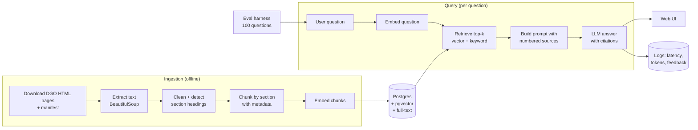

# SF Police Policy Explorer — Project Plan & Build Spec

> **Purpose of this file:** This is the complete plan for a resume project, written so that a future chat session (or any collaborator) can pick it up and continue building without re-deriving decisions. Drop it into the repo root as `PLAN.md` (and optionally copy the "Instructions for the AI assistant" section into `CLAUDE.md`).
>
> **Author:** Nav · **Plan written:** 2026-09-23 · **Status:** Week 0 complete (2026-09-26). **Weeks 1–2 (Ingestion) complete 2026-09-27:** 113 documents and 857 chunks in local Postgres. **All 857 chunks embedded 2026-09-27** (`gemini-embedding-001`); `app/retrieval.py` done and tested on the 5 example questions (5/5 right order at #1). **`app/generate.py` done 2026-10-02:** cited answers work end to end; LLM model ID `gemini-3.1-flash-lite` verified. **Weeks 3–4 (Basic RAG) complete 2026-10-03:** `ask.py` works; all 5 example questions answered with citations and the unanswerable one refused. Next: fix `chunk.py` path oddities, then Weeks 5–6 evals (see "Where we left off" in Section 7). **2026-09-27:** working style changed — the assistant writes the code and Nav learns by reading and asking questions (Section 0). **2026-09-26 update:** DGOs are HTML pages, not PDFs — ingestion now uses BeautifulSoup and `5.01.03`-style section numbers (see Section 2).

---

## 0. Instructions for the AI assistant helping with this project

Read this section first in any new chat.

- **Who Nav is:** still learning software engineering, relatively inexperienced. The goal is to *learn* and end up with a project Nav can explain line by line in an interview.
- **You write the code, and teach while doing it** (changed 2026-09-27 at Nav's request). Write all the code, including core logic (downloading, parsing, chunking, retrieval, prompt construction, eval scoring, the `/ask` endpoint), as well as boilerplate and config. Nav learns by reading every piece until he understands it and asking questions. So:
  - Explain the concept and the approach *before* showing the code.
  - Deliver code in small, runnable pieces (one function or file at a time), not a whole phase at once.
  - Comment the non-obvious lines; skip comments that just restate the code.
  - After each piece, call out the key decisions, the tradeoffs, and anything likely to come up in an interview.
  - Answer follow-up questions fully and patiently. Don't move on until Nav has run the piece and is happy he understands it.
- **Nav still owns the non-code decisions:** the 100 eval questions + reference answers, experiment choices and interpretation, the README and write-up. You can help edit these, but they should be his, since they are what he'll talk about in interviews.
- **Keep scope tight.** Finish each phase end-to-end before adding anything. Suggest the smallest next step.
- **Respect the project rules in Section 9** (unofficial branding, no personal data, legal-info disclaimers, source terms).
- **Check where we are:** look at the checklist in Section 7 and ask Nav which boxes are done before proceeding.
- **Prices and model names change.** Recheck anything in Section 6 before recommending purchases.
- **Do not edit the local `PLAN.md` on Nav's computer without explicit permission.** Work from the project's copy of this doc and ask before writing to the local file.

---

## 1. Project summary

**What it is:** A question-answering web app that answers questions about San Francisco Police Department policy and SF police-related law. Every answer cites the exact document and section it came from (e.g., "DGO 5.01, §5.01.03"), and says "I don't know" when the documents don't cover the question.

**Working name:** *SF Police Policy Explorer* (unofficial, independent project — **not** affiliated with SFPD).

**Target users:** SF residents, journalists, law/policy students, police recruits studying policy, community advocates.

**Example questions it should answer:**
- "When is an SFPD officer required to activate their body-worn camera?"
- "What does SFPD policy say about vehicle pursuits?"
- "How do I file a complaint against an officer, and what happens after?"
- "What de-escalation steps does the use-of-force policy require?"
- "What does the crowd control policy say about dispersal orders?"

**Why this is a strong resume project:**
- Real, public, local data that people actually care about.
- Legal/policy documents have exact section numbers → **citation accuracy can be scored automatically**, making the eval story rigorous.
- Demonstrates full-stack AI engineering: ingestion, vector DB, retrieval, LLM integration, evals, API, deployment, CI, monitoring, real users.

**Definition of done:**
- [ ] Public live URL, answers include clickable citations + document effective dates.
- [ ] 100-question eval set with results for ≥3 experiments in a README table.
- [ ] Tests + CI (GitHub Actions) run on every push.
- [ ] README with architecture diagram, demo GIF/video, eval results, setup steps.
- [ ] ≥10 real users; at least one improvement made from their feedback.

**Timeline:** ~12 weeks at 6–8 hours/week.

---

## 2. Data sources

| Phase | Source | What it is | Size | URL |
|---|---|---|---|---|
| 1 | SFPD Department General Orders (DGOs) | SFPD's official policy rulebook | 113 orders (current versions; checked 2026-09-27) | https://www.sanfranciscopolice.org/your-sfpd/policies/general-orders |
| 2 | SFPD Department Bulletins & Notices | Interim updates that modify policies between DGO revisions (organized by year) | Hundreds; start with last 2–3 years | https://www.sanfranciscopolice.org/your-sfpd/policies/department-bulletins-notices |
| 2 | SF Police Code | Part of SF Municipal Code most related to policing | Large; many articles | https://codelibrary.amlegal.com/codes/san_francisco/latest/sf_police/0-0-0-2 |
| Stretch | CA Penal Code / Vehicle Code (selected sections) | State law often referenced by DGOs | Pick sections only | leginfo.legislature.ca.gov |

**What the DGO pages actually look like (checked 2026-09-26):**
- **No PDFs.** Each order has its own HTML page (e.g. `https://www.sanfranciscopolice.org/your-sfpd/policies/general-orders/10-11`) with the **full policy text on the page**. PDF copies are only available via a public records request, so ingestion parses HTML with BeautifulSoup — pypdf is not needed for DGOs (kept installed in case Phase 2 bulletins turn out to be PDFs).
- **Listing page:** all orders on one page, no pagination, grouped by category. Each entry shows dates like `(Revised 9/4/24)(Effective 10/19/24)` — parse the effective date from there with a regex.
- **URL slugs aren't always clean** (e.g. Community Policing is `/general-orders/1-08-0`). Build `doc_id` (`DGO-1.08`) from the order number in the link text/title, not the slug.
- **Section numbering:** headings are `<order>.<nn> TITLE` in bold paragraphs (not `<h2>` tags), e.g. `5.01.01 PURPOSE`, `5.01.02 POLICY`, `5.01.03 DEFINITIONS`. Sub-items are numbered `1.`, `2.` with lettered `a.`, `b.` below them. Some sections contain tables.
- **robots.txt** (checked 2026-09-26): only admin, login, search and similar Drupal paths are disallowed; no crawl-delay. General Orders pages are allowed. Nav read the site's terms of use (2026-09-27) before the full download.
- **Some orders are listed twice** (checked 2026-09-27): an old version and a newer one at a URL ending in `-0` — 5.08, 5.20, 5.23, 6.13, 6.16, 8.12 (e.g. 5.08 "Non-Uniformed Officers", revised 1996, vs. 5.08 "Plainclothes, Non-Uniformed, and Undercover Officers", effective 2026-05-21). `download.py` keeps only the newest version by effective date (falling back to revised date) and prints a note for each.

**Example DGOs (good for first tests and eval questions):**
- DGO 5.01 — Use of Force Policy and Proper Control of a Person
- DGO 5.05 — Emergency Response and Pursuit Driving
- DGO 5.21 — Crisis Intervention Team (CIT) Response
- DGO 6.09 — Domestic Violence
- DGO 6.10 — Missing Persons
- DGO 8.03 — Crowd Control
- DGO 10.11 — Body Worn Cameras
- DGO 2.04 — Complaints Against Officers

**Data rules:**
- Before bulk-downloading, check each site's terms of use and `robots.txt`. The DGOs are on the city's own site. The municipal code is hosted by American Legal Publishing; read their terms before scraping — if bulk download isn't allowed, use a smaller set of manually saved sections.
- Download politely: add delays between requests (1–2 s), identify with a User-Agent, cache raw files locally so you never re-download unnecessarily.
- **Keep raw files in `data/raw/` and commit a manifest (`data/manifest.csv`: doc_id, title, source_url, revised_date, effective_date, downloaded_at), not necessarily the files themselves.**
- **Do NOT include** DataSF incident reports or any data about individuals. This project is about rules and policies only.

---

## 3. System architecture

Two paths: **ingestion** (offline, run when documents change) and **query** (online, every question). The **eval harness** runs the query path against a fixed question set.



### Components

| Component | Responsibility | Location |
|---|---|---|
| Downloader | Fetch DGO HTML pages (cached in `data/raw/`), write manifest | `ingest/download.py` |
| Parser | HTML → clean text, detect section structure | `ingest/parse.py` |
| Chunker | Split into section-aware chunks with metadata | `ingest/chunk.py` |
| Embedder | Batch-embed chunks, write to DB | `ingest/embed.py` |
| Retriever | Vector search, keyword search, hybrid fusion | `app/retrieval.py` |
| Generator | Prompt building, LLM call, citation parsing | `app/generate.py` |
| API | FastAPI app: `/ask`, `/feedback`, `/health`, `/metrics` | `app/main.py` |
| Web UI | Search box, answer, citation cards, thumbs up/down | `web/` |
| Eval harness | Run questions, score, save results | `evals/` |
| CI | Lint, test, small eval smoke test | `.github/workflows/ci.yml` |

### Chunking strategy (important for legal/policy text)

- **Split on section structure first**, not fixed word counts. DGOs use headings like `5.01.01 PURPOSE`, `5.01.02 POLICY`, `5.01.03 DEFINITIONS` (bold paragraphs in the HTML), with sub-items `1.`, `a.`. Detect these with regex (e.g. a line starting with `\d+\.\d+\.\d+` followed by an uppercase title) — or from the bold tags if that proves more reliable.
- If a section is longer than the max chunk size (start: ~400 words), split it further with ~50 words overlap.
- **As built (2026-09-27, `ingest/chunk.py`):** (1) a section ≤ 400 words is one chunk; (2) a longer section is split into units — each top-level item (A., B., 1. …) with everything nested under it, or a plain paragraph/table row — and neighbouring units are packed up to 400 words without cutting a unit; (3) a single unit over 400 words is cut into word windows with 50-word overlap (line breaks kept). Section paths: `10.11.05` (whole section), `10.11.05.B` (one item), `10.11.05.A-C` (group of items). The context prefix is added only by `embedding_text()` at embedding time, not stored in `content`, so the with/without-prefix experiment needs re-embedding only. Result: 857 chunks, 5–400 words (median 221); 94 chunks under 40 words (mostly one-line purpose statements) kept as whole sections for now — revisit if evals show they add noise.
- **Prepend context to each chunk** before embedding: `"DGO 5.01 Use of Force — 5.01.03 Definitions: <text>"`. This greatly improves retrieval.
- Store per chunk: `doc_id`, `doc_title`, `section_path` (e.g., `5.01.03`, or `5.01.03.2.a` for a sub-item — proposed format), `effective_date`, `source_url`, `chunk_index`. (`page_number` doesn't apply to HTML pages; the column stays in the schema as NULL for DGOs.)

### Retrieval strategy (evolves over phases)

1. **v1:** vector search only, top-k = 5, cosine distance. **As built 2026-09-27** in `app/retrieval.py` (`search()` takes a vector, `retrieve()` embeds the question first). **Finding:** cosine distance alone does NOT separate answerable from unanswerable questions — right #1 hits scored 0.18–0.27, but an unanswerable question ("drone pizza deliveries") still scored 0.297 (matched district boundaries / vehicle crashes / air support), and a real question's hits ran up to 0.292. Embeddings measure topic, not "answers the question". So refusal is handled by the grounded prompt ("say you couldn't find it"); a distance cutoff is at most a loose safety net, with its value picked from the ~15 labelled unanswerable eval questions, not guessed.
2. **v2 (experiment):** hybrid — vector search top 20 + Postgres full-text search top 20, merged with **Reciprocal Rank Fusion** (score = Σ 1/(60 + rank)), keep top 5. Keyword search helps with exact terms like "DGO 5.05" or "Taser".
3. **v3 (experiment):** rerank the top 20 with a reranker model or an LLM, keep top 5.

### Generation prompt (starting template — Nav should refine it)

```
You answer questions about San Francisco Police Department policy using ONLY the sources below.
Rules:
- Cite every claim with the source number in brackets, e.g. [2].
- If the sources do not answer the question, say "I couldn't find this in the policies I have." Do not guess.
- This is general information, not legal advice.

Sources:
[1] DGO 5.01 Use of Force — 5.01.03 Definitions (effective 2024-10-19)
<chunk text>
[2] ...

Question: <user question>
```

The app maps `[n]` back to `source_url` + `section_path` to render clickable citations.

**As built (2026-10-02, `app/generate.py`):**
- **Rules go in the system instruction; numbered sources + question go in the user message** (Nav's decision, 2026-09-28). Keeps the rules separate from text that comes from documents or users, so a source or question can't easily override them. The prompt also says sources are reference text, not instructions.
- **Sources:** retrieved chunks are grouped by (document, section path) so overlapping windows of one item become ONE numbered source (pieces put back in `chunk_index` order); numbered by best rank, so [1] is the closest match.
- **Source labels:** `DGO 10.11 Body Worn Cameras, §10.11.05.A-C ACTIVATION OF BODY WORN CAMERAS (effective 2025-11-06)`. Heading styles vary across orders — `10.11.05 TITLE`, `6.09.01. TITLE`, `6.14.03TITLE`, `III. TITLE`, `II.TITLE`, `III TITLE`, `Ill. TITLE` (typo on the page), trailing `.`/`:` — and `split_heading()` handles all of them (checked on all 857 chunks). The heading's own number is dropped because the path repeats it; DGO 6.08's unnumbered items show as `§III.A`; intro text shows the order name only; dates fall back to the revised date when there's no effective date. Labels are display-only — `section_path` in the DB is unchanged, so eval matching isn't affected.
- **Refusal:** the exact sentence lives in one constant (`REFUSAL`); `Answer.refused` checks for it (case-insensitive, curly apostrophes OK). No retrieved chunks → refusal without spending an LLM request.
- **Legal advice — added by code, never written by the model** (changed 2026-10-03). Every answer's text ends with `LEGAL_NOTE = "This is not legal advice."`, appended in code (`Answer.display_text`); `Answer.text` stays the model's own words so citation parsing, refusal detection and eval judging never see it. The fuller Section 9 footer (`DISCLAIMER`) is still shown alongside every answer. The prompt only says "explain what the policies say; don't give legal advice or opinions; don't add any disclaimer — the app adds one."
  - **Why it changed:** the first version had a conditional prompt rule ("if the question asks for advice about a specific situation, say a lawyer can advise"). In testing it fired unprompted in 2 of 7 runs (complaint, pursuits) and in the pursuits run leaked its own wording ("You can only explain what SFPD policy says"). Nav first chose to keep it and measure it in evals, then (same day) chose to have code add a fixed note and remove the conditional rule — no condition for the model to misjudge, nothing to leak, zero tokens. **Verified 2026-10-03** on the pursuits question (the one that leaked): answer ends with exactly the note, no lawyer sentence; same content and citations as before; input 2,779 tokens vs 2,839 (the removed rule saved ~60 tokens per question).
- **Citations:** `[n]`, `[1, 3]` and `[1][3]` are all parsed; numbers with no matching source are kept as `invalid_citations` (evals should count hallucinated citations).
- **Model settings:** temperature left at the default 1.0 (Google strongly recommends not lowering it for Gemini 3 — can cause looping); `thinking_level="minimal"` set explicitly (Flash Lite's default; a knob for Weeks 9–10); automatic function calling disabled (no tools are used; also removes the SDK's "AFC" notice); 30 s request timeout (the SDK's default is none).
- **Retries:** up to 3 attempts on 429/500/503 and on timeouts, waiting 5 s then 15 s; other errors (e.g. 400) fail immediately. Worst case 110 s.
- **Latency includes failed attempts and retry waits** (Nav's decision, 2026-10-02: that's how long a user actually waits). `Answer` also records input / output / thinking tokens and the model name — what the `queries` table needs later.
- **API:** uses `client.models.generate_content` (Google's docs now label this API "legacy" but it is still supported; the newer Interactions API is an option later).

---

## 4. Tech stack

| Layer | Choice | Why | Alternative |
|---|---|---|---|
| Language | Python 3.12+ | Beginner-friendly; the main AI language | TypeScript |
| Env/packages | `uv` | Fast; one tool for venv + deps | pip + venv |
| API | FastAPI + Uvicorn | Simple, typed, auto docs at `/docs` | Flask |
| Database | Postgres 16 + pgvector | Text, metadata, vectors, full-text search in one DB | Chroma |
| DB access | psycopg 3 (raw SQL) → optionally SQLAlchemy later | Learn SQL directly first | SQLAlchemy from start |
| Local DB | Docker Compose, image `pgvector/pgvector:pg16` | One command to start | Postgres.app |
| Page parsing | `beautifulsoup4` for the DGO HTML pages (`pypdf` kept for any PDF sources in Phase 2) | DGOs are HTML, not PDF (checked 2026-09-26) | `unstructured` |
| HTML parsing | `httpx` + `beautifulsoup4` | Fetch listing pages | `requests` |
| Embeddings | **`gemini-embedding-001`** ("Gemini Embedding 1"; free tier: 100 RPM / 30K TPM / 1,000 RPD). **Decided 2026-09-26: stay with Gemini** (see local-embeddings note below). **Decided 2026-09-27: use `-001`, not `gemini-embedding-2`** — per the Gemini embeddings docs, `-2` doesn't accept `task_type` (uses text prefixes like `title: … \| text: …` instead) and returns ONE combined embedding when given a plain list of texts unless each is wrapped in its own `Content`; `-001` is text-only, supports `RETRIEVAL_DOCUMENT` / `RETRIEVAL_QUERY`, 2,048-token input limit, 3,072 dims. The plan's old ID `gemini-embedding-1` is not a real model ID (fixed in `.env.example`). Comparing `-2` is a Weeks 9–10 experiment. | $0 on the free tier. The binding limit is 30K tokens/min: **Measured 2026-09-27 from the parsed corpus:** 113 DGOs, 484 sections, ~181K words (~1.18M chars). At 400-word chunks with 50-word overlap that's **~790 chunks (actual: 857) ≈ ~330K tokens** (incl. overlap + context prefixes, ~415 tokens/chunk) ≈ 11 min at the 30K TPM cap, **~13–15 min** with safety margin; ~16 requests of ~50 chunks. (200-word chunks ≈ 1,380 chunks; 800-word ≈ 590.) Replaces the earlier ~790K-token / 26–30 min guess. **To verify on the first run:** whether a 50-chunk batch counts as 1 or 50 toward the 1,000 RPD cap — if per chunk, one full run fits in a day but chunk-size experiments may need to spread over two days | OpenAI `text-embedding-3-small` (1536 dims, ~$0.02/1M tokens) — cheaper per-token if you go paid, but no free tier |
| LLM | **Gemini 3.1 Flash Lite or Gemini 3.5 Flash Lite, free tier** (`GEMINI_API_KEY`); model name in env var `LLM_MODEL`. **Verified 2026-10-02: `gemini-3.1-flash-lite` works** (the stable ID; the old `-preview` ID is shut down) | **$0 during dev/eval**, no card required. Confirmed from account dashboard (checked 2026-09-24): 15 req/min, 250K tokens/min, **500 req/day** — enough for a full 100-question eval run in one sitting. The non-Lite "full" Flash models (3.5/3.6/3.7/3.8 Flash) are much more restricted on this account — only 5 RPM / 20 RPD — too low for eval work. | OpenAI/Anthropic paid model — no rate cap (matters once real users show up in weeks 11–12), and the paid tier doesn't use your content to improve the provider's models |
| Keyword search | Postgres full-text (`tsvector`, GIN index) | Built in | `rank_bm25` |
| Rate limiting | `slowapi` | Protect API credit on public demo | Custom middleware |
| Frontend | Plain HTML + vanilla JS (React optional later) | Focus on backend | Streamlit |
| Tests | `pytest` | Standard | — |
| Lint/format | `ruff` | One tool | black + flake8 |
| CI | GitHub Actions | Free for public repos | — |
| Hosting | Render (web service) | Deploy from GitHub | Fly.io, Railway |
| Hosted DB | Supabase Postgres (has pgvector) | Free tier | **Neon** (see note below); Render Postgres (paid) |
| Observability | Structured JSON logs + `/metrics` page; optional Langfuse | Latency, cost, errors | — |

**Note on Neon (considered 2026-09-24, keeping Supabase for now):** Neon is a strong alternative. It's plain Postgres with no SDK, which matches our raw-SQL approach. It has the same 500 MB free tier and supports pgvector. It wakes faster (~300 ms vs ~1–2 s), though it suspends after 5 min idle, where Supabase waits about a week. It also has database branching, handy for testing schema changes during experiments. The project doesn't use Supabase's extras (auth, storage, auto-generated API). Switching costs little because the schema and psycopg code stay the same; only `DATABASE_URL` changes.

**Avoid LangChain/LlamaIndex for the core pipeline.** Writing retrieval yourself (~200 lines) teaches more and is easier to explain in interviews.

**On Gemini's free tier as the LLM default:** since your generation prompt is grounded — "answer only from these sources, cite them, refuse if they don't cover it" — this is a constrained task where budget-tier models across providers tend to hold up well; the failure modes to watch (hallucinating outside the sources, wrong citation numbers) come more from prompt design and retrieval quality than raw model size. Treat this as a starting assumption to verify with your own eval numbers (see the Weeks 9–10 experiment below), not a given.

**Local embeddings (considered 2026-09-26, deferred):** `sentence-transformers` models (e.g. `all-MiniLM-L6-v2`, 384 dims; `all-mpnet-base-v2`, 768 dims) run on the MacBook's CPU with no API calls, rate limits or cost, but are likely lower quality than Gemini's and add PyTorch as a heavy dependency. Kept as a Weeks 9–10 experiment so the eval harness can measure the difference instead of guessing.

**Free-tier quotas confirmed from Nav's own AI Studio dashboard (2026-09-24; re-confirmed unchanged 2026-09-26), replacing earlier estimates from general web sources:**

| Model | Category | RPM | TPM | RPD |
|---|---|---|---|---|
| Gemini 3.1 Flash Lite | LLM (generation) | 15 | 250K | 500 |
| Gemini 3.5 Flash Lite | LLM (generation) | 15 | 250K | 500 |
| Gemini 3.5 / 3.6 / 3.7 / 3.8 Flash (non-Lite) | LLM (generation) | 5 | 250K | 20 |
| Gemini Embedding 1 | Embeddings | 100 | 30K | 1,000 |
| Gemini Embedding 2 | Embeddings | 100 | 30K | 1,000 |

Rate limits are per-account and can change — re-check `aistudio.google.com/rate-limit` if something that used to work starts throwing 429s.

**Measured on the first full embedding run (2026-09-27, AI Studio dashboard): every text counts as one request toward RPM and RPD, even when 40 texts are sent in one API call.** After embedding ~860 chunks the dashboard showed RPD 805/1K, RPM 80/100 (two 40-chunk batches in one minute) and TPM 28.26K/30K (closer to the cap than intended — averaging the rate isn't the same as staying under it in every 60-second window). Consequences: (1) a full re-embed uses most of a day's 1,000 requests — at most one full re-embed per day, and a 200-word-chunk experiment (~1,380 chunks) spans two days (`embed.py` resumes where it stopped); (2) every question also costs one embedding request, so don't run a 100-question eval on the same day as a full re-embed; (3) `embed.py` now uses a sliding-window rate limiter (see Weeks 3–4).

---

## 5. Repository layout, schema, API, eval format

### Repo layout

```
SF-Policy-RAG/              # GitHub: Bath-Navroop/SF-Policy-RAG
├── PLAN.md                 # this file
├── ask.py                  # CLI: retrieved chunks + answer + timing (done)
├── README.md
├── pyproject.toml
├── docker-compose.yml
├── .env.example            # GEMINI_API_KEY=, OPENAI_API_KEY=, DATABASE_URL=, LLM_MODEL=, EMBED_MODEL=
├── .github/workflows/ci.yml
├── data/
│   ├── manifest.csv
│   └── raw/                # downloaded DGO HTML pages, e.g. DGO-5.01.html (gitignored if large)
├── ingest/
│   ├── download.py
│   ├── parse.py
│   ├── chunk.py
│   ├── load.py             # documents + chunks into Postgres (no embeddings)
│   └── embed.py
├── app/
│   ├── main.py             # FastAPI routes
│   ├── config.py           # env vars
│   ├── db.py
│   ├── retrieval.py
│   └── generate.py
├── web/
│   ├── index.html
│   └── app.js
├── evals/
│   ├── questions.jsonl
│   ├── run_evals.py
│   ├── judge.py
│   └── results/            # one JSON per run, timestamped
├── sql/
│   └── schema.sql
└── tests/
    ├── test_chunk.py       # done (9 tests)
    ├── test_generate.py    # done (30 tests, no API calls)
    ├── test_ask.py         # done (2 tests, no API calls)
    ├── test_parse.py
    └── test_api.py
```

### Database schema (`sql/schema.sql`)

**The `vector(N)` dimension must match whatever embedding model actually produces the vectors** — 1536 for OpenAI `text-embedding-3-small`, 3072 for Gemini Embedding 1/2. Pick one before running ingestion; switching later means re-embedding everything and altering this column, not just changing an env var.

**As built (2026-09-26):** `vector(3072)` for Gemini, with **no index on `embedding`**. `sql/schema.sql` in the repo is the source of truth. pgvector's HNSW and IVFFlat indexes only support up to 2,000 dimensions (applying the original schema failed with `column cannot have more than 2000 dimensions for hnsw index`). At this project's size (~1,000–2,000 chunks) no index is the better choice anyway:
- **Accuracy:** a sequential scan is exact, so it always returns the true top-k. HNSW is approximate and can miss results.
- **Speed:** an exact scan measured ~10–15 ms on 2,000 synthetic 3072-dim vectors — a tiny fraction of the question-embedding call (hundreds of ms) and the LLM call (1–3 s).
- **Quality:** full dimensions keep the most embedding quality. Google reports shortened Gemini embeddings (1,536 / 768) lose only a little, but here that trade would buy nothing.

**If the corpus grows** to tens of thousands of chunks, or storage gets tight on Supabase's 500 MB free tier (a 3072-dim vector is ~12 KB; the measured ~790 chunks ≈ 10 MB, 2,000 chunks ≈ 27 MB): switch the column to `halfvec(3072)` with an HNSW index (keeps all dimensions, about half the storage, works on current pgvector), or to 1,536 dims if evals show no accuracy loss. Measure with the eval harness before switching (see Weeks 9–10).

```sql
CREATE EXTENSION IF NOT EXISTS vector;

CREATE TABLE documents (
  id              TEXT PRIMARY KEY,          -- e.g. 'DGO-10.11'
  title           TEXT NOT NULL,
  source_type     TEXT NOT NULL,             -- 'dgo' | 'bulletin' | 'police_code'
  source_url      TEXT NOT NULL,
  effective_date  DATE,
  downloaded_at   TIMESTAMPTZ DEFAULT now()
);

CREATE TABLE chunks (
  id            BIGSERIAL PRIMARY KEY,
  document_id   TEXT REFERENCES documents(id) ON DELETE CASCADE,
  section_path  TEXT,                        -- e.g. '5.01.03' or '5.01.03.2.a'
  section_title TEXT,
  page_number   INT,                         -- NULL for HTML sources (DGOs)
  chunk_index   INT NOT NULL,
  content       TEXT NOT NULL,
  embedding     vector(3072),                -- 3072 = Gemini Embedding 1/2 (1536 if switching to OpenAI text-embedding-3-small)
  tsv           tsvector GENERATED ALWAYS AS (to_tsvector('english', content)) STORED
);

-- No index on embedding: pgvector indexes cap at 2,000 dims (see note above).
CREATE INDEX chunks_tsv_idx ON chunks USING gin (tsv);

CREATE TABLE queries (
  id             BIGSERIAL PRIMARY KEY,
  question       TEXT NOT NULL,
  answer         TEXT,
  chunk_ids      BIGINT[],
  latency_ms     INT,
  input_tokens   INT,
  output_tokens  INT,
  cost_usd       NUMERIC(10,6),
  feedback       SMALLINT,                   -- 1 = thumbs up, -1 = down, NULL = none
  created_at     TIMESTAMPTZ DEFAULT now()
);
```

Do **not** store IP addresses or user identities in `queries`.

### API

| Method | Path | Body / params | Returns |
|---|---|---|---|
| POST | `/ask` | `{"question": str}` | `{"answer": str, "citations": [{"n", "document_id", "title", "section_path", "effective_date", "url"}], "query_id": int}` |
| POST | `/feedback` | `{"query_id": int, "rating": 1 or -1}` | `{"ok": true}` |
| GET | `/health` | — | `{"status": "ok"}` |
| GET | `/metrics` | — | p50/p95 latency, avg cost/query, query count, % thumbs up |

Rate limit `/ask` (start: 10 requests/minute per client). Validate question length (e.g., ≤ 500 chars).

**If running the LLM on a Gemini Flash Lite free-tier model**, `/ask`'s own rate limit should stay comfortably under Gemini's cap (15 req/min, 500 req/day) so a burst of visitors doesn't trip 429s from Gemini itself — handle that error with a friendly "busy, try again" response rather than a raw failure.

### Eval question format (`evals/questions.jsonl`, one JSON per line)

```json
{"id": "q001", "question": "When must officers activate body-worn cameras?", "type": "lookup", "expected_answer": "Short reference answer written by Nav.", "expected_sources": ["DGO-10.11"], "expected_sections": ["10.11.xx"]}
{"id": "q087", "question": "What is SFPD's policy on drone deliveries of pizza?", "type": "unanswerable", "expected_answer": null, "expected_sources": [], "expected_sections": []}
```

(`10.11.xx` is a placeholder — use the real section number from the DGO page when writing questions.)

**Question mix (100 total):** ~60 `lookup` (one document), ~25 `multi` (needs 2+ documents/sections), ~15 `unanswerable`.

---

## 6. Costs (checked 2026-09-23, rate limits re-checked 2026-09-24 and 2026-09-26 — recheck before buying)

**Expected total:** ~$0–5 for the whole 12 weeks if using Gemini's free tier for the LLM (embeddings are still pennies); ~$5–15 if using a paid LLM throughout; ~$15–20/month if paying for an always-on demo.

| Item | Free option | Paid option | Notes |
|---|---|---|---|
| Embeddings | **`gemini-embedding-001` free tier: $0, 100 RPM / 30K TPM / 1,000 RPD — each text counts as a request (measured 2026-09-27)** | $0.02 / 1M tokens (OpenAI text-embedding-3-small) | All DGOs ≈ well under 1M tokens either way → pennies if paid, free on Gemini's free tier. |
| LLM | **Gemini 3.1/3.5 Flash Lite free tier: $0, no card, 15 req/min / 500 req/day / 250K tokens/min** | Cheapest current OpenAI/Anthropic model ≈ $0.05 in / $0.25 out per 1M tokens | Free tier trade-off: Google may use free-tier content to improve their products (the paid tier does not). Fine here since content is public policy text and user questions, not personal data — worth a line in the README. Stick to the **Lite** models — the full Flash models are capped at only 20 req/day on this account, too low for eval runs. |
| API credit | — | $5–10 one-time prepay (if not using the Gemini free tier) | **Set a hard monthly spending limit** regardless of provider |
| App hosting | Render free: sleeps after 15 min idle, ~1 min wake-up | Render $7/month always-on | Free is fine until sharing with users |
| Database | Supabase free: 500 MB, pauses after 1 week inactivity | Supabase Pro $25/mo, or Render Postgres from $6/mo | Avoid Render free Postgres — expires after 30 days |
| Domain | `*.onrender.com` subdomain | ~$10–15/year | Optional |
| GitHub, Actions, Docker, VS Code | Free | — | — |

Tip: a weekly scheduled GitHub Action that hits `/health` keeps the free Supabase DB from pausing.

Sources: Nav's own Gemini API rate-limit dashboard (aistudio.google.com/rate-limit, checked 2026-09-24), Gemini API pricing (ai.google.dev/gemini-api/docs/pricing), OpenAI embedding pricing (developers.openai.com/api/docs/models/text-embedding-3-small), OpenAI pricing (developers.openai.com/api/docs/pricing), Render pricing (render.com/pricing), Render free tier (render.com/docs/free), Supabase pricing (supabase.com/pricing).

---

## 7. Step-by-step build guide (checklist)

Each phase ends with something that works. Commit after every step. Mark boxes as you go so a future chat knows where you are.

### Week 0 — Setup ✅ complete 2026-09-26
- [x] Create accounts: GitHub, **Gemini API key (aistudio.google.com — free tier, no card)**, Render, Supabase.
- [x] Install on MacBook: Homebrew, Python 3.12+ (3.14.7 installed), `uv`, Git (+ SSH key on GitHub), Docker Desktop, VS Code (Python + Ruff extensions).
- [x] Create public GitHub repo (named `SF-Policy-RAG`: github.com/Bath-Navroop/SF-Policy-RAG); add this file as `PLAN.md`, a stub `README.md`, `.gitignore`, `.env.example`.
- [x] `pyproject.toml` with deps `fastapi uvicorn psycopg[binary] pgvector httpx beautifulsoup4 pypdf google-genai openai python-dotenv slowapi` (+ dev group: `pytest ruff`), written directly instead of via `uv init`; `uv sync` run locally; `uv.lock` committed.
- [x] `docker-compose.yml` with `pgvector/pgvector:pg16`, port bound to `127.0.0.1` only (so the DB isn't reachable from shared Wi-Fi); `docker compose up -d`; applied `sql/schema.sql` (no index on `embedding` — see Section 5).
- [x] Set `LLM_MODEL` to a **Flash Lite** model (Gemini 3.1 Flash Lite or 3.5 Flash Lite) and `EMBED_MODEL` to Gemini Embedding 1 or 2 — see Section 4 for the confirmed rate limits. (`.env.example` holds safe defaults; the real key is only in the gitignored `.env`. Verify the exact model ID strings against the Gemini API's model list on the first API call in Weeks 3–4. Embedding model verified 2026-09-27: `gemini-embedding-001`; LLM model ID verified 2026-10-02: `gemini-3.1-flash-lite`.)
- [x] **Done when:** you can connect to the local DB and see empty `documents` and `chunks` tables. Confirmed 2026-09-26: `documents`, `chunks`, `queries` exist; counts are 0.
- [x] Git: commits use the GitHub noreply email (`git config --global user.email`), because GitHub blocks pushes that expose a private email. Week 0 work committed and pushed.
- Skills refresh if needed: Python basics, Git (commit/branch/PR), terminal, HTTP/JSON, basic SQL (SQLBolt).

### Weeks 1–2 — Ingestion ✅ complete 2026-09-27
- [x] Check https://www.sanfranciscopolice.org/robots.txt — done 2026-09-26: General Orders pages allowed, no crawl-delay (see Section 2).
- [x] Read the site's terms of use before bulk downloading — done by Nav 2026-09-27.
- [x] (Done while writing `download.py`, 2026-09-27) Explore the pages by hand first: Inspect the listing links and the element holding the policy text on one DGO page; try `httpx` + `BeautifulSoup` in `uv run python`.
- [x] **Done 2026-09-27:** all 113 DGO pages saved in `data/raw/` (gitignored), `data/manifest.csv` has 113 rows; duplicate old/new listings resolved to the newest version (Section 2). Run: `uv run python ingest/download.py` (10 starter orders) or `--all`. Original spec: `download.py`: scrape the General Orders listing for `/general-orders/` links; download **10 DGO pages first** to `data/raw/DGO-x.xx.html` (skip if already saved; User-Agent; 1–2 s delay); write `manifest.csv` (doc_id, title, source_url, revised_date, effective_date from the listing text, downloaded_at). Build `doc_id` from the order number, not the URL slug.
- [x] **Done 2026-09-27:** `parse.py` writes `data/parsed/DGO-x.xx.json` (gitignored) with one entry per section (`number`, `heading`, `text`). Run: `uv run python -m ingest.parse` (10 starter), `--all`, or `DGO-10.11 --print` (readable Markdown; redirect to a `.md` file to preview in VS Code). Findings across all 113 pages: policy text is always in `#policy-content div.field--name-body`; headings are `<h2>`/`<h3>` tags in two styles (new `10.11.05 TITLE`, old `III. TITLE` — 44 orders); sub-item labels (A./1./a.) are drawn by CSS, not in the text, so the parser rebuilds them (verified: 10.11.05 items A–E match the text's own reference to "10.11.05 C"); tables are rendered one row per line with every value labelled by its column header; DGO 6.16 wraps sections inside a `<p>` (handled). Known leftover: 6.08's `III PROCEDURES` heading (no dot) gets no number; text is kept. `ingest/__init__.py` added so modules run with `python -m`.
- [x] Inspect output by eye for 3 documents (10.11, 5.21, 5.01) — done by Nav 2026-09-27; fixed table cells and header labels along the way.
- [x] **Done 2026-09-27:** `chunk.py` (see "As built" in Section 3). Sections come from `parse.py`'s HTML headings, so no heading regex is needed; top-level items are detected per line. Run: `uv run python -m ingest.chunk` (stats), `--all`, or `DGO-10.11 --print`. Doesn't write files; `load.py` imports it.
- [x] **Done 2026-09-27:** `tests/test_chunk.py`, 9 tests (short section = 1 chunk, nested lines stay with their item, splits between items not mid-item, max size respected, overlap correct, line breaks kept, metadata + indexes, embedding prefix). Run: `uv run pytest` (`pyproject.toml` has `[tool.pytest.ini_options] pythonpath = ["."]` so tests can import `ingest`).
- [x] **Done 2026-09-27:** `ingest/load.py` + `app/db.py` (`get_connection()`, reads `DATABASE_URL` from `.env`, autocommit + explicit transactions). Each order loads in its own transaction (upsert document, replace chunks); orders whose chunks are unchanged are skipped, so re-running never wipes embeddings. `sql/schema.sql` gained `documents.revised_date` plus an `ALTER TABLE … ADD COLUMN IF NOT EXISTS` so the file is safe to re-run (`docker exec -i sf-policy-rag-db psql -U postgres -d sf_policy_rag < sql/schema.sql`). Run: `uv run python -m ingest.load` or `--all`.
- [x] Expanded to all 113 DGOs — done 2026-09-27: 113 documents, 857 chunks.
- [x] **Done when:** `SELECT document_id, section_path, left(content, 80) FROM chunks LIMIT 20;` shows clean, sensible chunks — confirmed by Nav 2026-09-27. (Tips learned: add `ORDER BY document_id, chunk_index` since tables have no built-in order; `-P pager=off` avoids psql's pager, or press `q` to exit it.)

### Weeks 3–4 — Basic RAG (command line) ✅ complete 2026-10-03
- [x] **Done 2026-09-27:** all 857 chunks embedded (`gemini-embedding-001`, 3,072 dims) in one ~15-min run with no errors. Files: `app/config.py` (all settings from `.env` in one place, incl. `EMBED_DIM = 3072`; holds no secrets itself), `app/embeddings.py` (`embed_documents()` with `RETRIEVAL_DOCUMENT`, `embed_query()` with `RETRIEVAL_QUERY`; checks one 3,072-number vector per text), `ingest/embed.py` (only `WHERE embedding IS NULL`; each batch saved as it finishes, so it's resumable; retries 429/500/503 with 30/60/120/240 s backoff). **Updated after the first run:** batches of 30 and a sliding-window `RateLimiter` keeping any 60 s window under 70 requests and 26K estimated tokens (simulated worst window: 60 requests / ~24.8K tokens), ~60 chunks/min ≈ 15 min for a full run; warns when a run will use most of the daily 1,000 requests. Run: `uv run python -m ingest.embed --limit 5`, then `uv run python -m ingest.embed`. Check: `SELECT count(*), count(embedding), min(vector_dims(embedding)) FROM chunks;` → 857 / 857 / 3072.
- [x] **Done 2026-09-27:** `app/retrieval.py` — embed question (`RETRIEVAL_QUERY`) → `ORDER BY embedding <=> query LIMIT 5` (exact scan, ~4 ms; no index — see Section 5); returns chunk + everything a citation needs (doc id/title, section path/title, effective & revised dates, source URL, distance). `to_pgvector()` moved to `app/db.py` (code in `app/` must not import from `ingest/`). Try: `uv run python -m app.retrieval "question"` (`-k 10` for more). Each question costs 1 embedding request of the 1,000/day.
  - Results on the Section 1 examples: body cameras → 10.11.05.A-C (#1); pursuits → 5.05.02 then 5.05.05.A; complaints → 2.04.03.A, 2.04.01; de-escalation → 5.01.04.C (+ related 5.24 Disengagement at #4); dispersal orders → 8.03.03.D. Unanswerable "drone pizza deliveries" → unrelated chunks at 0.297–0.305 (see Section 3 finding).
  - Noticed, to handle later: (a) the same section path can appear twice when a long item was split into overlapping windows (e.g. 5.05.05.E at #3 and #5) — merge repeated paths when building citations (**done** in `generate.py`); (b) the top 5 often all come from one order, and low-value sections (purpose, admin info) fill #3–#5 — likely helped by the shared context prefix; that's what the prefix / hybrid / rerank experiments in Weeks 9–10 measure; (c) resident-phrased questions ("how do *I* file a complaint") vs. officer-facing text (DGO 2.04) — a good eval question type; (d) cosmetic: the CLI prints a dangling " — " when a chunk has no section title (**fixed** 2026-09-28; `search()` now also returns `chunk_index`).
- [x] **Done 2026-10-02:** `app/generate.py` — see "As built" under the generation prompt in Section 3. (Its own command line was removed 2026-10-03 — use `ask.py`.) Each question = 1 embedding request (of 1,000/day) + 1 Flash Lite request (of 500/day), plus any retries. `tests/test_generate.py`: 30 tests (29 at first; +1 for the legal note on 2026-10-03) with fake LLM responses (source merging, every heading style, prompt, citation parsing, refusal, retries/timeouts) — `uv run pytest` → 38 passed at the time.
  - **First real runs (body-camera question, 2026-10-02):** run 1 hit a 503 ("high demand"), retried after 5 s and succeeded — 77 s total, which led to the 30 s timeout. Run 2: 1.6 s, 1,727 input / 404 output / 0 thinking tokens. Both answers correct and cited §10.11.05.A-C; run 2 also cited §10.11.02 (definition of "activate") and §10.11.06.B (activate if sobriety-checkpoint screening leads to further investigation) — **Nav checked both against the DGO page: correct.**
  - **Same prompt, different answer:** identical input (same 1,727 tokens) but run 1 cited 1 source and run 2 cited 3, because temperature is 1.0. Eval scores will move a little between runs with no code change — consider running each config twice and comparing averages in Weeks 5–6.
  - **Found while checking labels on all 857 chunks — `chunk.py` path oddities to fix before evals** (eval questions reference section numbers): `§III.E-D` (DGO 8.07, letters restart), `§8.12.04.A-A`, `§I.A-5` / `§I.6-13` (10.01), `§IV.E-3` (11.06), `§2.02.04.C-3`, `§6.09.04.1-A` (ranges mixing item levels). Source-page typos kept as-is: DGO 1.06 has `1.061.01`; DGO 11.10 uses `11.07.xx` numbers.
- [x] **Done 2026-10-03:** `ask.py` (repo root). Run: `uv run python ask.py "question"` (`-k 10` for more chunks, `--full` for each chunk's complete text). Calls embed → search → generate as separate steps so each is timed; prints each retrieved chunk with rank, section path, distance and **which source number it became and whether the answer cited it**, then the answer + cited sources, then `Timing: embed · search · LLM · total` (DB connection time excluded — the API will reuse connections; LLM time includes retries) and tokens. `generate.py`'s own command line removed (one way to ask); `app.retrieval` keeps its CLI because it costs no LLM request. `tests/test_ask.py`: 2 tests (cited/not-cited notes incl. merged sources; full fake run of `main()`). `uv run pytest` → 41 passed (after the legal-note change).
- [x] Handle "nothing relevant" → answer says it couldn't find it. **Verified 2026-10-03:** "drone deliveries of pizza" → exact refusal sentence + one line on what the sources cover; `refused` detected; 38 output tokens. Retrieval returned unrelated chunks at 0.297–0.304 (same as 2026-09-27), so the refusal comes from the prompt, not a distance cutoff.
- [x] **Done 2026-10-03:** the 5 example questions from Section 1 (+ the unanswerable one), with Nav checking claims against the DGO pages:

  | Question | Retrieval (#1) | Chunks cited / retrieved | Result |
  |---|---|---|---|
  | Body cameras (3 runs) | 10.11.05.A-C | 1–3 of 5 | Run 2 over-generalised the en-route timing rule to all listed incidents (§10.11.05.B limits it to traffic/pedestrian stops and detentions/arrests); `ask.py` run correct but omitted 10.11.06.B's "or the safety of the patient is deemed to be at risk" |
  | Vehicle pursuits | 5.05.02 (0.184) | 5 of 5 (4 sources; 5.05.05.E windows merged) | Correct as far as checked; legal-advice line misfired and leaked prompt wording (rule since removed — see Section 3) |
  | Complaint (resident-phrased) | 2.04.03.A | 4 of 5 (3 of 4 sources; 2.04.03.A windows merged) | Translated officer-facing text for a resident; said timeline / DPA follow-up weren't in the sources; legal-advice line misfired |
  | De-escalation | 5.01.04.C-E | 3 of 5 sources, across DGO 5.01 + 5.24 | Correct — "fulfilled their duty" claim verified against 5.01.02 |
  | Crowd control / dispersal | 8.03.03.D-E | 2 of 5 | Correct — Penal Code 726 citation to §8.03.03.A-C verified |
  | Drone pizza (unanswerable) | unrelated chunks | 0 | Correct refusal |

  - **Lessons for evals:** (1) the same question with the same sources gave answers of three quality levels across runs (temperature 1.0) → run each config more than once; (2) the run-2 error was in a claim citing the *obviously relevant* source [1] and slipped past a check that only looked at unusual citations → the judge must check every claim; (3) quoted text is cheap to verify automatically — anything the model puts in quotation marks should appear word-for-word in the cited source; (4) retrieved-but-uncited chunks are common (often generic purpose/policy sections, or all 5 from one order) — what the hybrid/rerank experiments measure.
  - **Latency:** LLM 1.5–7.1 s without retries (one later pursuits run took 10.7 s with no retry — occasional slow calls are why p95 matters and the UI will need a "still thinking…" state) (5.7 s for a 38-token refusal → Gemini's own variation, not answer length); embedding ~0.4–0.5 s; search ~20–27 ms; input 1,533–2,839 tokens; output 38–558; thinking 0.
- [x] **Done when:** `uv run python ask.py "When must officers turn on body cameras?"` returns a cited answer — confirmed 2026-10-03.

**Where we left off (2026-10-03):** Weeks 3–4 complete. `ask.py`, `tests/test_ask.py`, the `generate.py` CLI removal and the code-added legal note are written and tested (Nav to commit: `git add ask.py app/ tests/ PLAN.md`). To resume: open Docker Desktop, `docker compose up -d`, check `SELECT count(*), count(embedding) FROM chunks;` → 857 / 857. **Next step:** fix the `chunk.py` section-path oddities listed under `generate.py` above (eval questions will reference section numbers; re-running `load.py` replaces only changed orders, so only their chunks need re-embedding). **Then Weeks 5–6:** Nav reads the DGOs and writes the first 50 eval questions (mix per Section 5); then `run_evals.py`.

### Weeks 5–6 — Evals v1 (most important phase)
- [ ] Read the DGOs and **write 50 questions** in `questions.jsonl` (mix per Section 5). Nav writes these personally.
- [ ] `run_evals.py`: run all questions, record retrieved doc IDs/sections, answer, latency, tokens. A 50–100 question run fits comfortably in the Flash Lite models' 500 req/day free-tier cap.
- [ ] Score automatically: retrieval hit rate @5 (any expected source in top 5), section hit rate, refusal accuracy on `unanswerable`. Also (from Weeks 3–4 findings): invalid citation numbers (`Answer.invalid_citations`), any disclaimer/legal line the model writes itself despite the prompt (the note is added by code, so a model-written one is a prompt-following failure), and quoted text that doesn't appear word-for-word in the cited source. Consider 2 runs per config to see run-to-run variation.
- [ ] `judge.py`: LLM-as-judge compares answer vs `expected_answer` → correct / partially / incorrect; also checks citations support claims.
- [ ] Manually check 20 judge verdicts; note agreement rate (e.g., "judge agreed with me 18/20").
- [ ] Save each run to `evals/results/<timestamp>_<config>.json`; print a summary table.
- [ ] **Done when:** one command produces a baseline score table. Record it in README.

### Weeks 7–8 — API, UI, tests, CI, deploy
- [ ] FastAPI `/ask`, `/feedback`, `/health`, `/metrics` per Section 5; log every query to `queries`.
- [ ] Rate limit with slowapi; validate input length; friendly error messages (including a graceful message if the LLM provider itself rate-limits you).
- [ ] `web/index.html` + `app.js`: question box, answer, citation cards (title, section, effective date, link), thumbs up/down, visible disclaimer.
- [ ] Tests: `test_api.py` with FastAPI TestClient (mock the LLM call).
- [ ] CI: ruff + pytest on every push; optional 5-question eval smoke test using a repo secret.
- [ ] Supabase: enable `vector` extension, apply schema, run ingestion against it.
- [ ] Render: deploy from GitHub; set env vars (never commit secrets).
- [ ] **Done when:** public URL works and CI badge is green.

### Weeks 9–10 — Experiments
- [ ] Grow eval set to 100 questions.
- [ ] Run experiments, **changing one variable at a time**, re-running evals each time:
  1. Chunk size: 200 vs 400 vs 800 words.
  2. Top-k: 3 vs 5 vs 10.
  3. Context prefix on chunks: with vs without.
  4. Hybrid search (vector + full-text, RRF) vs vector only.
  5. Reranking top 20 → 5.
  6. Small vs larger LLM (accuracy vs cost) — e.g. Gemini Flash Lite vs a non-Lite Flash model (note: the non-Lite models' 20 req/day cap means this comparison may need to run over a couple of days, or with a paid key).
  7. **LLM provider: Gemini free tier vs a paid OpenAI/Anthropic model** — compare accuracy, cost, latency, and how each behaves when you deliberately exceed its rate limit (does `/ask` degrade gracefully?).
  8. **Embeddings: Gemini vs local `sentence-transformers`** — retrieval hit rate, speed, cost. Also `gemini-embedding-001` vs `gemini-embedding-2` (needs `Content`-wrapped batching and text prefixes instead of `task_type`; see Section 4). Budget the 1,000 requests/day: one full re-embed per day.
  9. **Vector storage: `vector(3072)` exact scan vs `halfvec(3072)` + HNSW vs 1,536 dims** — retrieval hit rate, latency, storage (matters mainly if the corpus grows; see Section 5).
- [ ] Phase 2 data (optional here or stretch): add Department Bulletins and/or SF Police Code sections; measure whether accuracy drops with more sources.
- [ ] Track cost/question and p50/p95 latency for each config.
- [ ] **Done when:** README has a results table with ≥3 experiments, including what you kept and why.

### Weeks 11–12 — Real users and polish
- [ ] Share with ≥10 people (classmates, a civic-tech group like Code for America brigades / SF civic tech meetups, journalism or law students).
- [ ] Review `queries` table + thumbs-down answers; find the most common failure; fix it; re-run evals to confirm.
- [ ] Add a few real user questions (anonymized) to the eval set.
- [ ] If still on Gemini's free tier, watch for 429s during any traffic spike (e.g., after sharing the link widely) — 500 requests/day on Flash Lite is generous for casual sharing but could be hit if the link goes semi-viral. This is the main practical risk of staying on the free tier for the public demo.
- [ ] Write final README (Section 8 checklist). Record a 60-second demo video/GIF.
- [ ] **Done when:** real usage data + one feedback-driven fix are documented.

---

## 8. Resume-boosting steps

### README must include
- [ ] One-line pitch + live link + "unofficial, not legal advice" note.
- [ ] 60-second demo GIF or video.
- [ ] Architecture diagram (Section 3).
- [ ] Eval results table (baseline → best config, with cost + latency).
- [ ] "Key decisions and tradeoffs" (e.g., why Postgres over a vector DB, why section-aware chunking, why Gemini's free tier for the LLM and what that trades off).
- [ ] "What I learned / what I'd do next."
- [ ] Setup instructions that work on a fresh machine.
- [ ] CI badge.

### Resume bullets (fill in real numbers)
- Built **SF Police Policy Explorer**, a retrieval-augmented Q&A system over 110+ SFPD General Orders using Python, FastAPI, and Postgres/pgvector; deployed with CI/CD via GitHub Actions.
- Designed a 100-question evaluation suite; improved answer accuracy from **[X]%** to **[Y]%** and citation accuracy to **[Z]%** through section-aware chunking and hybrid (vector + full-text) search.
- Cut cost to **$[C]/query** and p95 latency to **[T]s**; served **[U]** users and shipped fixes driven by feedback analytics.

### Extra visibility moves
- [ ] Pin the repo on GitHub; clean commit history with meaningful messages.
- [ ] Write a short blog post / LinkedIn post: "What I learned building RAG over police policy" with the eval table.
- [ ] Open issues/PRs on your own repo to show a real workflow (branch → PR → CI → merge).
- [ ] Present it at a civic-tech meetup or class; mention it in the resume "Projects" section at the top if light on experience.

### Interview prep — be ready to answer
1. Walk through what happens from question to answer.
2. Why section-aware chunking? What broke with fixed-size chunks?
3. Why Postgres + pgvector instead of a dedicated vector DB?
4. How did you build the eval set, and how do you know the LLM judge is trustworthy?
5. Which experiment helped most? Which didn't, and why did you drop it?
6. How do you prevent hallucinated legal claims? What happens with unanswerable questions? (Talking point: similarity scores alone didn't separate answerable from unanswerable questions — 0.27 vs 0.30 — so refusal comes from the grounded prompt, and any cutoff is tuned on labelled unanswerable questions. Second talking point: prompt rules can misfire — a conditional "only if asked for legal advice" rule fired unprompted in 2 of 7 runs and once leaked its own wording, so it was removed and the "not legal advice" note is appended by code instead: anything that must always happen belongs in code, not in the prompt.)
7. How would this scale to all SF codes / 1M documents / 1,000 concurrent users?
8. How do you handle policy updates and outdated versions?
9. Why a free-tier LLM provider, and what would you change moving to production?
10. Hardest bug and how you found it. (Candidates: the free tier counting every embedded text as a request — found from the AI Studio dashboard after the first run, fixed with a sliding-window rate limiter; Gemini's 3072-dim embeddings exceed pgvector's 2,000-dim index limit, and why dropping the index was the right call at this scale — see Section 5; or the downloader silently keeping the 1996 version of orders listed twice, caught by questioning why there were 113 orders instead of ~70 — see Section 2; or the first real answer taking 77 s — a Gemini 503 retry plus the SDK having no default timeout, fixed with a 30 s timeout that is retried like a server error.)
11. Why does the same question give different answers, and how do you evaluate that? (Talking point: identical prompts gave answers citing 1 vs 3 sources at temperature 1.0, which Google recommends keeping for Gemini 3 — so compare averages over repeated runs, not single runs.)

---

## 9. Project rules (ethics, safety, legal)

- **Unofficial branding.** No SFPD logo, badge, or name as the product name. Footer on every page: *"Independent project. Not affiliated with the San Francisco Police Department. General information, not legal advice. Always check the linked official source."*
- **Policy documents only.** No incident data, arrest records, or information about individuals.
- **Show effective dates** on every citation; flag when a bulletin may have modified a DGO.
- **Refuse rather than guess.** Unanswerable questions should get a clear "couldn't find this" response. Weight refusal accuracy heavily in evals.
- **Respect source terms.** Check terms/robots before scraping; rate-limit downloads; link back to official sources.
- **Privacy.** Don't log IPs or identities; tell users questions are logged anonymously to improve the tool.
- **Secrets.** Real API keys and the hosted (Supabase) `DATABASE_URL` live only in the gitignored `.env` and Render's environment settings — never in `.env.example`, `docker-compose.yml` or anything else committed. The local `postgres:postgres@localhost` URL in `.env.example` is a harmless dev default.
- **LLM provider data use.** If running on a free-tier API (e.g., Gemini), note in the README that the provider may use query content to improve their products — different from a paid tier's terms. Acceptable here since the content sent is public policy text and user questions, not personal data; revisit if that ever changes.
- **Cost safety.** Hard spending limit on any paid API account; rate-limit the public endpoint; handle provider rate-limit errors (429s) gracefully rather than surfacing raw failures.

---

## 10. Risks and fallbacks

| Risk | Fallback |
|---|---|
| Stuck for days on setup/deploy | Timebox 2 sessions, then ask the AI assistant with the exact error |
| Some DGO pages have odd HTML (tables, headings not bold, inconsistent markup) | Detect headings by regex on the extracted text instead of tags; hand-fix the worst few; note it in README |
| Section heading regex misses formats | Log unmatched docs; fall back to fixed-size chunks for those |
| Municipal code terms forbid scraping | Stay with DGOs + bulletins; manually save a few Police Code sections |
| API bill surprises | Hard limit; use small model for most eval runs; Gemini free tier avoids this entirely for the LLM |
| Gemini free tier rate limits hit in production | Fall back to a paid model, or queue/backoff requests; this is why the experiment in Weeks 9–10 measures both |
| Gemini returns 503 "high demand" or hangs (seen 2026-10-02) | 30 s timeout + up to 2 retries (5 s, 15 s) in `call_llm`; if it persists, try `gemini-3.5-flash-lite` via `LLM_MODEL`; `/ask` should show a friendly "busy, try again" |
| Accidentally using a non-Lite Flash model | Only 20 req/day free — eval runs will fail fast with 429s; switch `LLM_MODEL` back to a Flash Lite variant |
| Motivation dips | Each phase is a shippable checkpoint; post weekly progress |
| Answers look good but are wrong | Trust eval numbers, not demos |
| Embedding dimension exceeds pgvector's index limit | Hit in Week 0: no index at current scale; `halfvec` + HNSW or fewer dims if the corpus grows (Section 5) |

## 11. Stretch goals (after week 12)

- Cache repeated questions (Redis) and measure latency drop.
- Background job queue for automatic re-ingestion when DGOs are updated (scheduled check of the General Orders page).
- "What changed?" feature comparing old vs new versions of a DGO.
- Streaming answers.
- Add selected CA Penal/Vehicle Code sections referenced by DGOs; cross-link citations.
- Admin dashboard for feedback, costs, and top questions.
