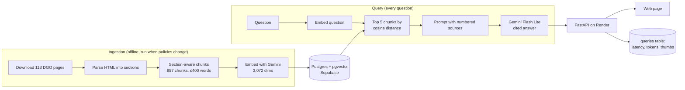

# SF Police Policy Explorer

[](https://github.com/Bath-Navroop/SF-Policy-RAG/actions/workflows/ci.yml)

Ask questions about San Francisco Police Department policy in plain English. Answers come **only** from SFPD's Department General Orders, cite the exact section they come from, and say so when the policies don't cover the question.

**Live demo: https://sf-police-policy-explorer.onrender.com**
(Free hosting: if nobody has used it for 15 minutes, the first question can take up to a minute while the server wakes up.)

> **Unofficial, independent project.** Not affiliated with the San Francisco Police Department. General information, not legal advice. Always check the linked official source.

**Example questions:**
- When must officers turn on body-worn cameras?
- What does SFPD policy say about vehicle pursuits?
- How do I file a complaint against an officer?
- What de-escalation steps does the use-of-force policy require?

Every answer includes numbered citations like `[1]` that link to a source card: the order, the section (e.g. `DGO 10.11, §10.11.05.A-C`), its effective date, and a link to the official page.

---

## How it works

This is a retrieval-augmented generation (RAG) system built without a RAG framework. Every step (scraping, chunking, embedding, search, prompting, citation parsing) is plain Python and SQL.



1. **Ingestion** (`ingest/`): download every General Order page (politely: cached, rate-limited, robots.txt checked), parse the HTML into numbered sections, split long sections between items (never mid-item), and embed each chunk with `gemini-embedding-001`.
2. **Retrieval** (`app/retrieval.py`): embed the question and fetch the 5 nearest chunks with pgvector's cosine distance (`<=>`).
3. **Generation** (`app/generate.py`): number the sources, merge chunks from the same section into one source, and ask Gemini to answer using only those sources, citing each claim. The answer's `[n]` markers are parsed back into citations; any number with no matching source is flagged.
4. **API and web page** (`app/main.py`, `web/`): FastAPI serves `/ask`, `/feedback` and `/health`, plus a plain HTML/CSS/JS page. Each question and its thumbs up/down is logged anonymously.

## Key decisions and tradeoffs

- **Section-aware chunking instead of fixed word counts.** Policies are organised by numbered sections and items, so chunks follow that structure. This is what makes exact citations like `§10.11.05.B` possible.
- **No vector index, on purpose.** Gemini embeddings have 3,072 dimensions, and pgvector's HNSW/IVFFlat indexes cap at 2,000. At 857 chunks an exact scan takes milliseconds, which is tiny next to the LLM call, and it never misses a result. If the corpus grows: `halfvec` + HNSW.
- **Refusal comes from the prompt, not a similarity cutoff.** Testing showed that cosine distance measures topic, not "answers the question". A made-up question scored about as close as real ones, so the model is told to reply with one exact refusal sentence, which the code detects.
- **Anything that must always happen is done in code, not the prompt.** A conditional "mention a lawyer if asked for advice" rule fired unprompted in 2 of 7 test runs and once leaked its own wording. The "not legal advice" note is now appended by code.
- **Rules in the system instruction, documents and question in the user message.** Retrieved text is treated as reference material, never as instructions.
- **Model output is untrusted.** The web page never inserts the answer with `innerHTML`. It builds the paragraphs, lists and citation links itself, so an answer containing HTML or script can't run in the browser (XSS).
- **Rate limits at two levels.** There is a per-visitor limit for fairness, and a site-wide limit that keeps the app under Gemini's free-tier quota, which is shared by every visitor.
- **Postgres + pgvector instead of a dedicated vector database.** Text, metadata, vectors and full-text search (for the hybrid-search experiment) all live in one database, queried with plain SQL.

## Tech stack

| Layer | Choice |
|---|---|
| Language / packages | Python 3.14, [uv](https://docs.astral.sh/uv/) |
| Database | Postgres 16 + pgvector (Docker locally, Supabase in production), psycopg 3 with raw SQL |
| Embeddings | Google `gemini-embedding-001` (3,072 dimensions) |
| LLM | Google `gemini-3.1-flash-lite` |
| API | FastAPI + Uvicorn, slowapi rate limiting |
| Frontend | Plain HTML, CSS and JavaScript (no framework) |
| Hosting | Render (from `render.yaml`) + Supabase |
| Quality | pytest (63 tests, no API calls needed), ruff, GitHub Actions CI |

## Project status

- [x] Ingestion of all 113 current General Orders (857 chunks)
- [x] Retrieval, cited answers, refusal of unanswerable questions, CLI (`ask.py`)
- [x] API, web page, tests, CI, public deployment
- [ ] Evaluation set: 100 hand-written questions with reference answers, scored for retrieval hit rate, citation accuracy and refusal accuracy (results table coming)
- [ ] Experiments: hybrid (vector + full-text) search, reranking, chunk size, top-k, embedding models
- [ ] Department Bulletins and SF Police Code as additional sources

Known limitation: on a few pages the site's HTML nesting is broken, so the item part of some section paths (e.g. `§8.12.04.A-A`) can be misleading. The order, section and link are still correct.

---

## Run it locally

**Prerequisites:** [uv](https://docs.astral.sh/uv/getting-started/installation/), [Docker Desktop](https://www.docker.com/products/docker-desktop/), and a free [Gemini API key](https://aistudio.google.com/apikey).

```bash
git clone https://github.com/Bath-Navroop/SF-Policy-RAG.git
cd SF-Policy-RAG
uv sync                                   # installs Python 3.14 and all dependencies
cp .env.example .env                      # then put your GEMINI_API_KEY in .env

docker compose up -d                      # Postgres + pgvector on localhost:5432
docker exec -i sf-policy-rag-db psql -U postgres -d sf_policy_rag < sql/schema.sql
```

**Build the database** (one-time):

```bash
uv run python ingest/download.py --all    # ~113 pages, 1–2 s apart; cached in data/raw/
uv run python -m ingest.parse --all
uv run python -m ingest.load --all
uv run python -m ingest.embed             # ~15 min; resumable
```

Embedding uses about 857 of the free tier's 1,000 embedding requests per day. If it stops partway, run it again the next day; it only embeds chunks that don't have an embedding yet.

**Ask questions:**

```bash
uv run uvicorn app.main:app --reload      # web page at http://127.0.0.1:8000, API docs at /docs
uv run python ask.py "When must officers turn on body cameras?"   # CLI: shows chunks, answer, timing
```

**Tests and lint** (no API key or database needed; Gemini and Postgres are faked):

```bash
uv run pytest
uv run ruff check . && uv run ruff format --check .
```

## Deploy

`render.yaml` describes the Render web service: build with `uv sync`, start Uvicorn, health check `/health`. In Render: **New → Blueprint**, select this repo, and enter two secrets:

- `GEMINI_API_KEY`
- `DATABASE_URL`: a Postgres database with pgvector. With Supabase, use the **Session pooler** connection string, because the direct connection is IPv6-only on the free plan.

To copy an already-embedded local database to the hosted one (no re-embedding):

```bash
docker exec -i sf-policy-rag-db psql "$DATABASE_URL" < sql/schema.sql
docker exec sf-policy-rag-db pg_dump -U postgres -d sf_policy_rag --data-only --table=documents --table=chunks \
  | docker exec -i sf-policy-rag-db psql "$DATABASE_URL" --single-transaction
```

If you use Supabase, turn off its Data API (Integrations → Data API). The app connects to Postgres directly, and `schema.sql` also enables Row Level Security as a second lock.

## Data, privacy and usage

- **Sources:** SFPD Department General Orders from [sanfranciscopolice.org](https://www.sanfranciscopolice.org/your-sfpd/policies/general-orders), public policy documents only. No incident data and no information about individuals.
- **What's logged:** each question, its answer, timing, token counts and thumbs up/down. No accounts, and **no IP addresses** (used only in memory for rate limiting, never stored or logged).
- **LLM provider:** questions are sent to Google's Gemini API on its free tier, where Google may use the content to improve its products. That's acceptable here because the content is public policy text plus anonymous questions, but don't type personal information into the box.
- **Not legal advice.** Answers can be wrong or out of date; every answer links to the official source and shows its effective date.

## License

[MIT](LICENSE)
